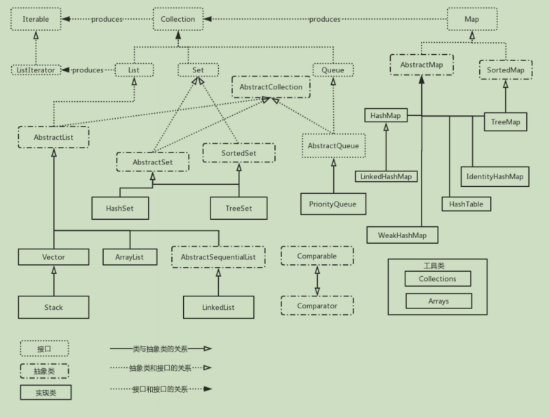
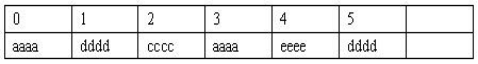
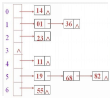
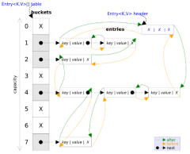
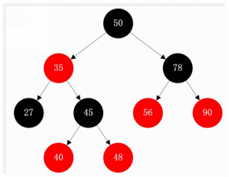
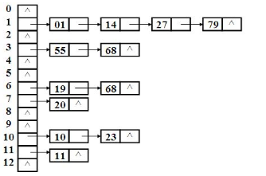
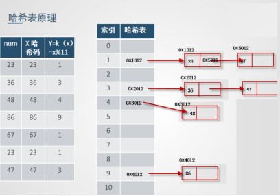
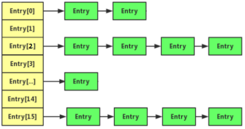
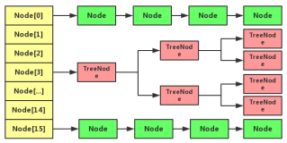
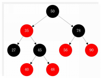

# Java集合

开局先来一张神图



## List集合

List 集合的主要实现类有 ArrayList（Object[]数组实现） 和 LinkedList（双端链表实现），List集合还包括了栈和队列的实现类 Deque 和 Queue

实际开发中，一般采用面向接口的编程

```java
List<Integer> list = new ArrayList<>();
//它不能够调用子类的方法，只能调用List这个超类拥有的方法
```

### **List特点**

- 有序，不唯一（可重复)

### 与数组的区别

- 数组可以放基本数据类型和引用数据类型
- 集合中只能存放引用数据类型：即基本数据类型需要使用包装类进行包装后，再放入集合中

### **ArrayList - 顺序表**

**特点**

- 底层是Object[ ]实现的，存的是一个一个的对象
- 内存分配连续的空间，数组长度可变
- 增删慢，需要大量移动元素；随机访问，查找快



#### 遍历方式

1. for循环

2. for -each循环 

3. Iterator 迭代器

   ```java
   List<Integer> list = new ArrayList<>();
   Iterator it = list.iterator();
   while (it.hasNext()){
       System.out.println(it.next());
   }
   ```

4. Lambada 表达式 + 流式编程(jdk1.8)

   ```java
   list.forEach((i)-> System.out.println(i));
   list.forEach(System.out::println); 
   ```

#### 源码解析

其底层就是一个长度可以动态增长的Object数组，StringBuilder底层就是一个长度可以动态增长的char数组。

1. JDK1.7中，默认初始大小为10
2. JDK1.8中，默认初始大小为0，即第一次添加就要扩容

**扩容源码**

```java
private void grow(int minCapacity) {
        // overflow-conscious code
    	// 扩容 50%
        int oldCapacity = elementData.length;
        int newCapacity = oldCapacity + (oldCapacity >> 1);
        if (newCapacity - minCapacity < 0)
            newCapacity = minCapacity;
        if (newCapacity - MAX_ARRAY_SIZE > 0)
            newCapacity = hugeCapacity(minCapacity);
        // minCapacity is usually close to size, so this is a win:
        elementData = Arrays.copyOf(elementData, newCapacity);
    }
```

**内部类 Itr**

​	定义了一个内部类，并实现了Iterator接口，用来实现迭代器遍历集合的功能

```java
public Iterator<E> iterator() {
    return new Itr();
}
private class Itr implements Iterator<E> {
}	
```

#### 常用方法

| boolean                                                      | [add](#add(E))([E](mk:@MSITStore:C:\Users\Administrator\Desktop\JDK_API_1_6_zh_CN.CHM::/java/util/List.html) e)向列表的尾部添加指定的元素（可选操作）。 |
| ------------------------------------------------------------ | ------------------------------------------------------------ |
| void                                                         | [add](#add(int, E))(int index, [E](mk:@MSITStore:C:\Users\Administrator\Desktop\JDK_API_1_6_zh_CN.CHM::/java/util/List.html) element)       在列表的指定位置插入指定元素（可选操作）。 |
| boolean                                                      | [addAll](#addAll(java.util.Collection))([Collection](mk:@MSITStore:C:\Users\Administrator\Desktop\JDK_API_1_6_zh_CN.CHM::/java/util/Collection.html)<? extends [E](mk:@MSITStore:C:\Users\Administrator\Desktop\JDK_API_1_6_zh_CN.CHM::/java/util/List.html)> c)       添加指定 collection 中的所有元素到此列表的结尾，顺序是指定 collection 的迭代器返回这些元素的顺序（可选操作）。 |
| boolean                                                      | [addAll](#addAll(int, java.util.Collection))(int index, [Collection](mk:@MSITStore:C:\Users\Administrator\Desktop\JDK_API_1_6_zh_CN.CHM::/java/util/Collection.html)<? extends [E](mk:@MSITStore:C:\Users\Administrator\Desktop\JDK_API_1_6_zh_CN.CHM::/java/util/List.html)> c)   将指定 collection 中的所有元素都插入到列表中的指定位置（可选操作）。 |
| void                                                         | [clear](#clear())()  从列表中移除所有元素（可选操作）。      |
| boolean                                                      | [contains](#contains(java.lang.Object))([Object](mk:@MSITStore:C:\Users\Administrator\Desktop\JDK_API_1_6_zh_CN.CHM::/java/lang/Object.html) o) 如果列表包含指定的元素，则返回 true。 |
| boolean                                                      | [containsAll](#containsAll(java.util.Collection))([Collection](mk:@MSITStore:C:\Users\Administrator\Desktop\JDK_API_1_6_zh_CN.CHM::/java/util/Collection.html)<?> c)       如果列表包含指定 collection 的所有元素，则返回 true。 |
| [E](mk:@MSITStore:C:\Users\Administrator\Desktop\JDK_API_1_6_zh_CN.CHM::/java/util/List.html) | [get](#get(int))(int index) 返回列表中指定位置的元素。       |
| boolean                                                      | [isEmpty](#isEmpty())() 如果列表不包含元素，则返回 true。    |
| Iterator<E>                                                  | [***\*iterator\****](#iterator())() 返回按适当顺序在列表的元素上进行迭代的迭代器。 |
| [E](mk:@MSITStore:C:\Users\Administrator\Desktop\JDK_API_1_6_zh_CN.CHM::/java/util/List.html) | [***\*remove\****](#remove(int))(int index)  移除列表中指定位置的元素（可选操作）。 |
| boolean                                                      | [remove](#remove(java.lang.Object))([Object](mk:@MSITStore:C:\Users\Administrator\Desktop\JDK_API_1_6_zh_CN.CHM::/java/lang/Object.html) o)  从此列表中移除第一次出现的指定元素（如果存在）（可选操作）。 |
| boolean                                                      | [removeAll](#removeAll(java.util.Collection))([Collection](mk:@MSITStore:C:\Users\Administrator\Desktop\JDK_API_1_6_zh_CN.CHM::/java/util/Collection.html)<?> c)       从列表中移除指定 collection 中包含的其所有元素（可选操作）。 |
| boolean                                                      | [retainAll](#retainAll(java.util.Collection))([Collection](mk:@MSITStore:C:\Users\Administrator\Desktop\JDK_API_1_6_zh_CN.CHM::/java/util/Collection.html)<?> c)       仅在列表中保留指定 collection 中所包含的元素（可选操作）。 |
| [E](mk:@MSITStore:C:\Users\Administrator\Desktop\JDK_API_1_6_zh_CN.CHM::/java/util/List.html) | [set](#set(int, E))(int index, [E](mk:@MSITStore:C:\Users\Administrator\Desktop\JDK_API_1_6_zh_CN.CHM::/java/util/List.html) element) 用指定元素替换列表中指定位置的元素（可选操作）。 |
| int                                                          | [size](#size())() 返回列表中的元素数。                       |

### **LinkedList - 链表**

#### 特点

- 底层采用双向链表存储元素
- 查找慢，增删快
- 它实现了Deque接口，可以作为栈、队列、线性表来使用


```java
List<String> list = new LinkedList<>();
```

#### 源码解析

```java
public class LinkedList<E>
    extends AbstractSequentialList<E>
    implements List<E>, Deque<E>, Cloneable, java.io.Serializable{
    //transient ，取消序列化
    transient int size = 0;//节点的数量
    transient Node<E> first; //指向第一个节点
    transient Node<E> last; //指向最后一个节点
    public LinkedList() {}
    //内部类Node，表示节点
    private static class Node<E> {
        E item;//存储节点的数据
        Node<E> next;//指向后一个节点
        Node<E> prev; //指向前一个节点
        Node(Node<E> prev, E element, Node<E> next) {
            this.item = element;
            this.next = next;
            this.prev = prev;
        }
	}
}
```

#### 增加方法

 addFirst()、addLast()、removeFirst()、removeLast()、getFirst()、getLast()

### Stack - 过时了

```java
class Stack<E> extends Vector<E> {}	
```

### Deque - 双端队列

```java
public interface Deque<E> extends Queue<E> {}
//作为栈时，比Stack快，作为队列时，比Deque快
Deque<String> deque = new ArrayDeque<>();
Deque<String deque = new LinkedList<>();
```

- ArrayDeque：底层使用数组
- LinkedList：底层使用双向链表

## Set集合

-  	无序，唯一（不重复）
- 相比Collection没有增加任何方法，List相比Collection增加了索引的一些方法

### 遍历Set集合的方法

1. for each
2. iterator迭代器
3. lambuda表达式

### HashSet

- 底层原理：采用哈希表的存储结构
- 优点：添加速度快、查询速度快、删除速度也快
- 缺点：无序

#### 源码解析

- HashSet的底层使用的是HashMap，所以底层结构也是哈希表 
- HashSet的元素在HashMap中做为key键，value统一是同一个Object()

```java
public class HashSet<E> implements Set<E> {
    private transient HashMap<E, Object> map;
    private static final Object PRESENT = new Object();//只有一份，所有的Set的Object值都指向它
    public HashSet() {
        map = new HashMap<>();
    }
    public boolean add(E e) {
        return map.put(e,  new Object()) == null;
        return map.put(e, PRESENT) == null;
    }
    public int size() {
        return map.size();
    }
    public Iterator<E> iterator() {
        return map.keySet().iterator();
    }
}
```


### LinkedHashSet

- 采用哈希表+链表结构存储

- 使用了链表来维护次序，所以是有序的（添加顺序）

  

### TreeSet

- 采用二叉平衡搜索树（红黑树）的存储结构

- 按照自然顺序排序

- 优点：有序的、查询速度比List快（按照内容进行查询）

- 缺点：查询速度没有HashSet快

  

#### 源码解析

- TreeSet的底层使用的是TreeMap，所以底层结构也是红黑树 
- TreeSet的元素e是作为TreeMap的key存在的，value统一为同一个 Object()

```java
public class TreeSet<E> implements NavigableSet<E> {
    //底层的TreeMap的引用
    private transient NavigableMap<E, Object> m; 
    private static final Object PRESENT = new Object();
    public TreeSet() {
        //创建TreeSet对象就是创建一个TreeMap对象
        this(new TreeMap<E, Object>()); 
    }
    TreeSet(NavigableMap<E, Object> m) {
        this.m = m;
    }
    public boolean add(E e) {
        return m.put(e, PRESENT) == null;
    }
    public int size() {
        return m.size();
    }
}
```

### 一些问题

1. 为什么HashSet和LinkedHashSet存储String（系统提供的包装类）是唯一的，但是存储自己定义的Student类就不唯一了？

   因为，String类的系统类，它已经重写了equals 和 hashCode方法，所以可以保证唯一性，而Student类是自己定义的类，尚未重写必要的方法，故会导致存储数据不唯一。

2. 为什么TreeSet 存储String是有序的，但是存储Student时却报异常？

   因为，TreeSet是采用红黑树来存储数据的，在添加元素时需要进行比较，Student类必须要去实现Comparable 接口并且重写 compareTo方法
   
   ```java
   //实现接口，重写compareTo方法
   @Override
   public int compareTo(Object o) {
       return 0;
   }
   //或者直接使用匿名内部类就可以
   //在jdk1.8后，可以直接用lambuda表达式
   Set<Student> set = new TreeSet<Student>((stu1,stu2)->{
       if(stu1.getScore()>stu2.getScore())
           return 1;
       else if(stu1.getScore() < stu2.getScore())
           return -1;
       else
           return 0;
   });
   
   ```

## 哈希表

### 哈希表的结构

Hashtable 也叫 ”散列表“，特点就是快、很快、非常快

结构：结构有很多种，最容易、最流行的为：顺序表+链表

主结构：顺序表，每个顺序表的节点再单独引出一个链表



### 哈希表是如何添加数据的？

1.  计算哈希码(调用hashCode(),结果是一个int值，整数的哈希码取自身即可) 

2. 计算在哈希表中的存储位置  y=k(x)=x%11

    x:哈希码  k(x)  函数y：在哈希表中的存储位置 

3.  存入哈希表 

   1.  情况1：一次添加成功 
   2.  情况2：多次添加成功（出现了冲突，调用equals()和对应链表的元素进行比较，比较到最后，结果都是false，创建新节点，存储数据，并加入链表末尾） 
   3.  情况3：不添加（出现了冲突，调用equals()和对应链表的元素进行比较， 经过一次或者多次比较后，结果是true，表明重复，不添加） 

- 结论1：哈希表添加数据快（3步即可，不考虑冲突）  

- 结论2：唯一、无序 

  

### 哈希表是如何查询数据的？

和添加数据的过程是相同的 

- 情况1：一次找到  23  86  76 
- 情况2：多次找到  67  56  78 
- 情况3：找不到  100 200 

 结论1：哈希表查询数据快  

### hashCode 和 equals 的作用？

- hashCode():计算哈希码，是一个整数，根据哈希码可以计算出数据在哈希表中的存储位置
- equals()：添加时出现了冲突，需要通过equals进行比较，判断是否相同；查询时也需要使用equals进行比较，判断是否相同 

### 各种类型数据的哈希码应该如何获取 hashCode()？

- int  取自身，即 1则看Integer的源码 

```java
public int hashCode() { return Integer.hashCode(value);}
```

- double  3.14 3.15  3.145  6.567  9.87  取整不可以  看Double的源码 

```java
public static int hashCode(double value) {
        long bits = doubleToLongBits(value);
        return (int)(bits ^ (bits >>> 32));
    }
```

- String java  oracle  j+a+v+a  将各个字符的编码值相加是不可行的，可以采用以下方式 

  ```java
  public int hashCode() {
          int h = hash;
          if (h == 0 && value.length > 0) {
              char val[] = value;
  
              for (int i = 0; i < value.length; i++) {
                  h = 31 * h + val[i];
              }
              hash = h;
          }
          return h;
      }
  ```

- Student 先各个属性的哈希码，进行某些相加相乘的运算 

  ​    int id       String name      int age      double score;

### 如何减少冲突？

1. 哈希表的长度和表中的记录数的比例--装填因子： 

   如果Hash表的空间远远大于最后实际存储的记录个数，则造成了很大的空间浪费， 如果选取小了的话，则容易造成冲突。 在实际情况中，一般需要根据最终记录存储个数和关键字的分布特点来确定Hash表的大小。还有一种情况时可能事先不知道最终需要存储的记录个数，则需要动态维护Hash表的容量，此时可能需要重新计算Hash地址。 

   **装填因子=表中的记录数/哈希表的长度**， 4/ 16  = 0.25            8/ 16=0.5

   如果装填因子越小，表明表中还有很多的空单元，则添加发生冲突的可能性越小；而装填因子越大，则发生冲突的可能性就越大，在查找时所耗费的时间就越多。 有相关文献证明当装填因子在<font color='red'>0.5</font>左右时候，Hash性能能够达到最优。 
   
   因此，一般情况下，装填因子取经验值0.5。 
   
2. 哈希函数的选择

   ​     直接定址法   平方取中法  折叠法  **除留取余法（y = x%11）**

3. 处理冲突的方法 

   ​     链地址法  开放地址法  再散列法  建立一个公共溢出区 

## Map集合

**特点**

​	存储的键值对映射关系，根据 key 可以找到 value

**Set 和 Map 的关系**

​	如果Map中只存储key，不存储value，就是对应的Set

### 常用方法

```java
Map<String,String> map = new HashMap<>();
System.out.println(map); // 所有 key-values
System.out.println(map.entrySet());// 所有的 entry对象， <key,value>
System.out.println(map.keySet()); // 所有的key
System.out.println(map.values()); // 所有的value
//遍历1：
Set<String> keySet = map.keySet();
for(String key:keySet){
    System.out.println(key + "" + map.get(key);
}
//遍历2：
Set<Map.Entry<String,String>> entrySet = map.entrySet();
Iterator<Map.Entry<String, String>> iterator = entries.iterator();
while (iterator.hasNext()) {
    Map.Entry<String, String> next = iterator.next();
    System.out.println(next);
    System.out.println(next.getKey() + ":" + next.getValue());
}
```

### LinkedHashMap

- 采用哈希表存储结构，同时使用链表维护次序
- key：有序（添加顺序）

### HashMap

- 采用哈希表(Hashtable)存储结构

- key：无序，唯一 ，返回类型：HashSet

- value: 无序，不唯一 ，返回类型：Collection

#### 源码解析

JDK1.7之前：底层是一个 table 数组 + 链表实现的哈希表存储结构



##### **Entry 的结构**

链表的每个节点就是一个Entry，包括键 key、值 value、键的哈希码 hash、执行下一个节点的引用 next 四个部分

```java
static class Entry<K, V> implements Map.Entry<K, V> {
    final K key; //key
    V value;//value
    Entry<K, V> next; //指向下一个节点的指针
    int hash;//哈希码
}
```

##### **JDK1.7中HashMap的主要成员变量及其含义**

```java
public class HashMap<K, V> implements Map<K, V> {
//哈希表主数组的默认长度
    static final int DEFAULT_INITIAL_CAPACITY = 16;  // 1<<4
//默认的装填因子
    static final float DEFAULT_LOAD_FACTOR = 0.75f; 
//主数组的引用！！！！
    transient Entry<K, V>[] table; 
    int threshold;//界限值  阈值
    final float loadFactor;//装填因子
    public HashMap() {
        this(DEFAULT_INITIAL_CAPACITY, DEFAULT_LOAD_FACTOR);
    }
    public HashMap(int initialCapacity, float loadFactor) {
        this.loadFactor = loadFactor;//0.75
        threshold = (int) Math.min(capacity * loadFactor, 
MAXIMUM_CAPACITY + 1);//16*0.75=12
        table = new Entry[capacity];
      ....
    }
}
```

**put方法解析**

- 调用put方法添加键值对。哈希表三步添加数据原理的具体实现；是计算key的哈希码，和value无关。特别注意：

1. 第一步计算哈希码时，不仅调用了key的hashCode()，还进行了更复杂处理，目的是尽量保证不同的key尽量得到不同的哈希码

2. 第二步根据哈希码计算存储位置时，使用了位运算提高效率。同时也要求主数组长度必须是2的幂）

3. 第三步添加Entry时添加到链表的第一个位置，而不是链表末尾

4. 第三步添加Entry是发现了相同的key已经存在，就使用新的value替代旧的value，并且返回旧的value

```java
public V put(K key, V value) {
    //如果key是null，特殊处理
    if (key == null) return putForNullKey(value);
    //1.计算key的哈希码hash 
    int hash = hash(key);
    //2.将哈希码代入函数，计算出存储位置  y= x%16；
    int i = indexFor(hash, table.length);
    //如果已经存在链表，判断是否存在该key，需要用到equals()
    for (Entry<K,V> e = table[i]; e != null; e = e.next) {
        Object k;
        //如找到了,使用新value覆盖旧的value，返回旧value
        if (e.hash == hash && ((k = e.key) == key || key.equals(k))) { 
            V oldValue = e.value;// the United States
            e.value = value;//America
            e.recordAccess(this);
            return oldValue;
        }
    }
    //添加一个结点
    addEntry(hash, key, value, i);
    return null;
}
final int hash(Object k) {
    int h = 0;
    h ^= k.hashCode();
    h ^= (h >>> 20) ^ (h >>> 12);
    return h ^ (h >>> 7) ^ (h >>> 4);
}
static int indexFor(int h, int length) {
    //作用就相当于y = x%16,采用了位运算，效率更高
    return h & (length-1);
}
```

**addEntry解析**

- 添加元素时如达到了阈值，需扩容，每次扩容为原来主数组容量的2倍

```java
void addEntry(int hash, K key, V value, int bucketIndex) {
    //如果达到了门槛值，就扩容，容量为原来容量的2位 16---32
    if ((size >= threshold) && (null != table[bucketIndex])) {
        resize(2 * table.length);
        hash = (null != key) ? hash(key) : 0;
        bucketIndex = indexFor(hash, table.length);
    }
    //添加节点
    createEntry(hash, key, value, bucketIndex);
}
```

**get方法解析**

- 调用get方法根据key获取value。
  - 哈希表三步查询数据原理的具体实现
  - 其实是根据key找Entry，再从Entry中获取value即可

```java
public V get(Object key) {
    //根据key找到Entry（Entry中有key和value）
    Entry<K,V> entry = getEntry(key);
    //如果entry== null,返回null，否则返回value
    return null == entry ? null : entry.getValue();
}
```

##### JDK1.8中的变化

- 在JDK1.8中有一些变化，当链表的存储数据个数大于等于8的时候，不再采用链表存储，而采用红黑树存储结构。这么做主要是查询的时间复杂度上，链表为O(n)，而红黑树一直是O(logn)。如果冲突多，并且超过8，采用红黑树来提高效率



### TreeMap 红黑树

- key：有序（自然排序） 唯一，返回类型：TreeSet
- value：无序，不唯一，返回类型：Collection



#### **源码解析**

##### **节点的结构**


```java
static final class Entry<K,V> implements Map.Entry<K,V> {
    K key;
    V value;
    Entry<K,V> left;
    Entry<K,V> right;
    Entry<K,V> parent;
    boolean color = BLACK;
}
```

##### 主要成员变量及其含义

```java
public class TreeMap<K, V> implements NavigableMap<K, V> {
    private final Comparator<? super K> comparator;//外部比较器
    private transient Entry<K, V> root = null; //红黑树根节点的引用
    private transient int size = 0;//红黑树中节点的个数
    public TreeMap() {
        comparator = null;//没有指定外部比较器
    }
    public TreeMap(Comparator<? super K> comparator) {
        this.comparator = comparator;//指定外部比较器
    }
}
```

##### 添加原理

- 从根节点开始比较 
- 添加过程就是构造二叉平衡树的过程，会自动平衡 
- 平衡离不开比较：外部比较器优先，然后是内部比较器。如果两个比较器都没有，就抛出异常

```java
public V put(K key, V value) {
    Entry<K,V> t = root;
    //如果是添加第一个节点，就这么处理
    if (t == null) {
        //即使是添加第一个节点，也要使用比较器
        compare(key, key); // type (and possibly null) check
        //创建根节点
        root = new Entry<>(key, value, null);
        //此时只有一个节点
        size = 1;
        return null;
    }
    //如果是添加非第一个节点，就这么处理
    int cmp;
    Entry<K,V> parent; 
    Comparator<? super K> cpr = comparator;
    //如果外部比较器存在，就使用外部比较器
    if (cpr != null) {
        do {
            parent = t;
            cmp = cpr.compare(key, t.key);
            if (cmp < 0)
                t = t.left;//在左子树中查找
           else if (cmp > 0)                
                t = t.right; //在右子树查找
            else
               //找到了对应的key，使用新的value覆盖旧的value                 
                return t.setValue(value);
        } while (t != null);
    }
    else {
        //如果外部比较器没有，就使用内部比较器
       ....
    }
    //找到了要添加的位置，创建一个新的节点，加入到树中
    Entry<K,V> e = new Entry<>(key, value, parent);
    if (cmp < 0)  
        parent.left = e;
    else
        parent.right = e;       
    size++;
    return null;
}
```

##### 查询原理

原理基本与添加相同

```java
public V get(Object key) {
    //根据key（cn）找Entry（cn--China）
    Entry<K,V> p = getEntry(key);
    //如果Entry存在，返回value：China
    return (p==null ? null : p.value);
}

final Entry<K, V> getEntry(Object key) {
    //如果外部比较器存在，就使用外部比较器
    if (comparator != null)
        return getEntryUsingComparator(key);
    if (key == null)
        throw new NullPointerException();
    @SuppressWarnings("unchecked")
    //如果外部比较器不存在，就使用内部比较器
    Comparable<? super K> k = (Comparable<? super K>) key;
    Entry<K, V> p = root;
    while (p != null) {
        int cmp = k.compareTo(p.key);
        if (cmp < 0)
            p = p.left;
        else if (cmp > 0)
            p = p.right;
        else
            //如果找到了，就返回Entry
            return p;
    }
    //如果没有找到，就返回null
    return null;
}
```


