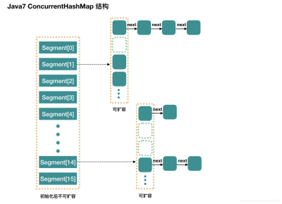
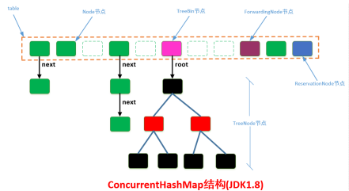
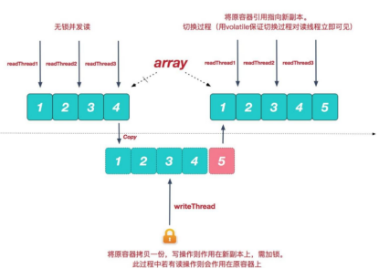

## 集合的发展历程

- 早期集合类Vector、Hashtable：线程安全的。是怎么保证线程安全的呢，使用synchronized修饰方法 

- 为了提高性能，使用ArrayList、HashMap替换，线程不安全，但是性能好。使用ArrayList、HashMap，需要线程安全怎么办呢？

  使用Collections.synchronizedList(list)、Collections.synchronizedMap(m)解决，底层使用synchronized代码块锁。虽然也是锁住了所有的代码，但是锁在方法里边，并所在方法外边性能可以理解为稍有提高吧。毕竟进方法本身就要分配资源的 

- 在大量并发情况下如何提高集合的效率和安全呢？ 

  提供了新的线程同步集合类，位于java.util.concurrent包下，使用Lock锁或者volatile+CAS的无锁化。 

  - ConcurrentHashMap
  - CopyOnWriteArrayList 
  - CopyOnWriteArraySet

## 新一代的并发集合类

### ConcurrentHashMap

​	分段（segment）锁定 + Lock 锁

#### JDK1.7

HashMap的线程安全版，性能比Hashtable、Collections.***synchronizedMap***(m);都有提高。使用的不是synchronized代码块锁，也不是synchronzied方法锁。并且使用了锁分离技术，**使用多个锁来控制对hash表的不同部分（段segment）进行的修改**，采用**ReentrantLock锁**（重进入锁）来实现。如果多个修改操作发生在不同的段上，他们就可以并发进行，从而提高了效率。JDK1.7和JDK1.8的关于ConcurrentHashMap的实现差异较大，以上理论属于JDK1.7。



#### JDK1.8

**ConcurrentHashMap在JDK8中进行了巨大改动。**它摒弃了Segment（锁段）的概念，而是启用了一种全新的方式实现,利用 volatile + CAS 实现无锁化操作。 它底层由"数组"+链表+红黑树的方式思想(JDK8中HashMap的实现)， 为了做到并发，又增加了很多辅助的类，例如TreeBin，Traverser等对象内部类。



### CopyOnWriteArrayList

**CopyOnWrite+Lock锁，**对于set()、add()、remove()等方法使用ReentrantLock的lock和unlock来加锁和解锁。读操作不需要加锁（之前集合安全类，即使读操作也要加锁，保证数据的实时一致）

**CopyOnWrite原理：写时复制。** 

> 通俗的理解是当我们往一个容器添加元素的时候，不直接往当前容器添加，而是先将当前容器进行Copy，复制出一个新的容器，然后新的容器里添加元素，
>
> 添加完元素之后，再将原容器的引用指向新的容器。这样做的好处是我们可以对CopyOnWrite容器进行并发的读，而不需要加锁，因为当前容器不会添加任何元素。所以CopyOnWrite容器也是一种读写分离的思想，读和写不同的容器。 
>
> 对于读操作远远多于写操作的应用非常适合，特别在并发情况下，可以提供高性能的并发读取。 CopyOnWrite容器<font color='red'>只能保证数据的最终一致性，</font>不能保证数据实时一致性。**所以如果你希望写入的的数据，马上能读到，请不要使用CopyOnWrite容器。** 



#### 源码

注意：读的时候不需要加锁，如果读的时候有多个线程正在向ArrayList添加数据，读还是会读到旧的数据，因为写的时候不会锁住旧的ArrayList

```java
public boolean add(E e) {
    final ReentrantLock lock = this.lock;
    lock.lock();
    try {
        Object[] elements = getArray();
        int len = elements.length;
// 复制出新数组
        Object[] newElements = Arrays.copyOf(elements, len + 1);
// 把新元素添加到新数组里
        newElements[len] = e;
// 把原数组引用指向新数组
        setArray(newElements);
        return true;
    } finally {
        lock.unlock();
    }
}
final void setArray(Object[] a) {
    array = a;
}
public E get(int index) {
    return get(getArray(), index);
}
```

### CopyOnWriteArraySet

**CopyOnWrite + Lock锁**

它是<font color='red'>线程安全</font>的<font color='red'>无序</font>的集合，可以将它理解成线程安全的HashSet。 有意思的是，CopyOnWriteArraySet和HashSet虽然都继承于共同的父类AbstractSet； 但是，HashSet是通过"散列表(HashMap)"实现的，而CopyOnWriteArraySet则是通过"动态数组(CopyOnWriteArrayList)"实现的，并不是散列表。

CopyOnWriteArraySet在CopyOnWriteArrayList 的基础上使用了Java的装饰模式，所以底层是相同的。而CopyOnWriteArrayList本质是个动态数组队列，所以CopyOnWriteArraySet相当于通过通过动态数组实现的"集合"！ 

CopyOnWriteArrayList中允许有重复的元素；但CopyOnWriteArraySet是一个集合，所以它不能有重复集合。因此，CopyOnWriteArrayList额外提供了addIfAbsent()和addAllAbsent()这两个添加元素的API，通过这些API来添加元素时，只有当元素不存在时才执行添加操作！ 
