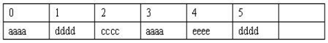

## 集合常用的概念辨析

| 集合类型          | 存储结构    | 顺序            | 唯一    | 查询             | 添加、删除 |
| ----------------- | ----------- | --------------- | ------- | ---------------- | ---------- |
| **ArrayList**     | 顺序表      | 有序（添加）    | 不唯一  | 索引查询效率最高 | 效率低     |
| **LinkedList**    | 双向链表    | 有序（添加）    | 不唯一  | 效率低           | 效率高     |
| **HashSet**       | 哈希表      | 无序            | 唯一    | 效率最高         | 效率最高   |
| **HashMap**       | 哈希表      | Key无序         | key唯一 | 效率最高         | 效率最高   |
| **LinkedHashSet** | 哈希表+链表 | 有序(添加)      | 唯一    | 效率最高         | 效率最高   |
| **LinkedHashMap** | 哈希表+链表 | Key有序（添加） | key唯一 | 效率最高         | 效率最高   |
| **TreeSet**       | 红黑树      | 有序（自然）    | 唯一    | 效率中等         | 效率中等   |
| **TreeMap**       | 红黑树      | 有序（自然）    | key唯一 | 效率中等         | 效率中等   |

### 集合与数组的比较

数组不是面向对象的，存在明显的缺陷，集合完全弥补了数组的一些缺点，比数组更灵活更实用，可大大提高软件的开发效率而且不同的集合框架类可适用于不同场合。具体如下：

1.  :数组容量固定且无法动态改变，集合类容量动态改变。 

2.  数组能存放基本数据类型和引用数据类型的数据，而集合类中只能放引用数据类型的数据。

3.  数组无法判断其中实际存有多少元素，length只告诉了array容量；集合可以判断实际存有多少元素，而对总的容量不关心 

4.  集合有多种数据结构（顺序表、链表、哈希表、树等）、多种特征（是否有序，是否唯一）、不同适用场合（查询快，便于删除、有序），不像数组仅采用顺序表方式 

5.  集合以类的形式存在，具有封装、继承、多态等类的特性，通过简单的方法和属性调用即可实现各种复杂操作，大大提高软件的开发效率。

### ArrayList 和 LinkedList 的联系与区别

- 联系：
  - 都实现了List接口
  - 有序  不唯一（可重复）
- ArrayList
  - 特点：在内存中分配连续的空间，实现了长度可变的数组
  - 优点：遍历元素和随机访问元素的效率比较高
  - 缺点：添加和删除需大量移动元素效率低，按照内容查询效率低

- LinkedList
  - 特点：采用链表存储方式，底层是双向链表。
  - 缺点：遍历和随机访问元素效率低下
  - 优点：插入、删除元素效率比较高（但是前提也是必须先低效率查询才可。如果插入删除发生在头尾可以减少查询次数）

### 哈希表的原理（HashMap的底层原理）

- 哈希表的特征 
  - 快：查询快、添加快 
- 哈希表的结构 
  - 最常用、最容易理解的结构（JDK1.7）:数组+链表 
  - JDK1.8:数组+链表/红黑树（链表长度>=8）  

- 哈希表添加原理
  - 计算哈希码 （hashCode()）；
  - 计算存储位置（存储位置就是数组的索引）；
  - 存入指定位置（要处理冲突，可能重复。需借助equals()进行比较）
- 哈希表查询原理
  - 同哈希表添加原理
- 其他
  - hashCode()和equals()的作用；
  - 如何减少冲突；
  - 如何生产不同数据类型的哈希码

### TreeMap的底层原理

- 基本特征

  二叉树、二叉查找树、二叉平衡树、红黑树

- 每个节点的结构

- 添加原理
  - 从根节点开始比较 
  - 添加过程就是构造二叉平衡树的过程，会自动平衡 
  - 平衡离不开比较：外部比较器优先，然后是内部比较器，否则出错

- 查询原理与添加基本相同

### Collection 和 Colletions 的区别

- Collection是Java提供的集合接口，存储一组不唯一，无序的对象。它有两个子接口List和Set。
- Java中还有一个Collections类，专门用来操作集合类 ，它提供一系列静态方法实现对各种集合的搜索、排序、线程安全化等操作。

### Vector和ArrayList的联系和区别 

实现原理和ArrayList相同，功能相同，都是长度可变的数组结构，很多情况下可互用

- 两者的主要区别如下
  - Vector是早期JDK接口，ArrayList是替代Vector的新接口
  - Vector线程安全效率低下；ArrayList重速度轻安全，线程非安全
  - 长度需增长时，Vector默认增长一倍，ArrayList增长50%

### HashMap 和 Hashtabel 的联系和区别

- 实现原理相同，功能相同，底层都是哈希表，查询速度快，在很多情况下可互用
- 两者的主要区别如下
  - Hashtable是早期JDK提供的接口，HashMap是新版JDK提供的接口
  - Hashtable继承Dictionary类，HashMap实现Map接口
  - Hashtable线程安全，HashMap线程非安全
  - Hashtable不允许null值，HashMap允许null值

