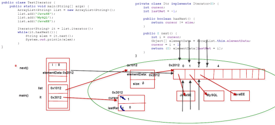

# 集合的其他内容

## Iterator

- Iterator专门为遍历集合而生，集合并没有提供专门的遍历的方法
- Iterator实际上迭代器设计模式的实现

**常用方法**

- boolean hasNext(): 判断是否存在另一个可访问的元素 
- Object next(): 返回要访问的下一个元素
- void remove(): 删除上次访问返回的对象

### **常见问题**

**哪些集合可以使用 Iterator 遍历**

- 层次1：Collection、List、Set可以、Map不可以
- 层次2：提供iterator()方法的就可以将元素交给Iterator
- 层次3：实现Iterable接口的集合类都可以使用迭代器遍历

**for-each循环和Iterator的联系**

- for-each循环(遍历集合)时，底层使用的是Iterator
- 凡是可以使用for-each循环(遍历的集合)，肯定也可以使用Iterator进行遍历

**for-each循环和Iterator的区别**

- for-each还能遍历数组，Iterator只能遍历集合
- 使用for-each遍历集合时不能删除元素，会抛出异常ConcurrentModificationException使用Iterator遍历集合时能删除元素

**Iterator是一个接口，它的实现类在哪里？**

- 在相应的集合实现类中 ,比如在ArrayList中存在一个内部了Itr implements Iterator

**为什么Iterator不设计成一个类，而是一个接口**

- 不同的集合类，底层结构不同，迭代的方式不同，所以提供一个接口，让相应的实现类来实现

### 迭代器源码分析

以ArrayList为例子

```java
public Iterator<E> iterator() {
    return new Itr();
}
//简化后的代码
private class Itr implements Iterator<E> {
    int cursor;    //  光标，表示当前位置
    int lastRet = -1;   //上一个元素位置
    public boolean hasNext() {
        return cursor != size;
    }
    public E next() {
       int i = cursor;
       Object[] elementData = ArrayList.this.elementData;
       cursor = i + 1;
        return (E) elementData[lastRet = i];
    }
}
```



## ListIterator

### 常见问题

- ListIterator和Iterator的关系
  - public interface ListIterator<E> extends Iterator<E>
  - 都可以遍历List
- ListIterator和Iterator的区别
  - 使用范围不同
    - Iterator可以应用于更多的集合，Set、List和这些集合的子类型。
    - ListIterator只能用于List及其子类型。
  - 遍历顺序不同
    - Iterator只能顺序向后遍历; ListIterator还可以逆序向前遍历
  - Iterator可以在遍历的过程中remove();ListIterator可以在遍历的过程中remove()、add()、set()
  - ListIterator可以定位当前的索引位置，nextIndex()和previousIndex()可以实现。Iterator没有此功能。

### 示例

```java
public class TestListIterator {
    public static void main(String[] args) {
        //创建一个集合对象
        List<Integer> list = new ArrayList<Integer>();
        //向集合中添加分数
        list.add(78);
        list.add(80);
        list.add(89);        
        ListIterator<Integer> lit = list.listIterator();        
        while(lit.hasNext()){
            lit.next();
        }        
        while(lit.hasPrevious()){
            int elem = lit.previous();
            System.out.println(elem +"  "+lit.nextIndex()
+"  "+lit.previousIndex());
        }
    }
}
```


## Collections 工具类

- 关于集合操作的工具类，好比Arrays，Math 
- 唯一的构造方法private，不允许在类的外部创建对象 
- 可以利用Collections来简化集合的操作

```java
public class TestCollections {
    public static void main(String[] args) {
        //添加元素
        List<Integer> list = new ArrayList();
        Collections.addAll(list, 10, 50, 30, 90, 85, 100);//6
        System.out.println(list);
        //排序
        Collections.sort(list);//默认按照内部比较器
        System.out.println(list);
        //查找元素(元素必须有序)
        int index = Collections.binarySearch(list, 500);//不存在返回负数
        System.out.println(index);
        //获取最大值和最小值
        int max = Collections.max(list);
        int min = Collections.min(list);
        System.out.println(max + "   " + min);
        //填充集合
        Collections.fill(list, null);
        System.out.println(list);
        //复制集合
        List list2 = new ArrayList();
        Collections.addAll(list2, 10, 20, 30, 50);
        System.out.println(list2);
        Collections.copy(list, list2);//dest.size >= src.size  目标列表的长度至少必须等于源列表。
        System.out.println(list);
        //同步集合
        //StringBuffer 线程安全效率低 StringBuilder 线程不安全，效率高
        //Vector 线程安全  效率低  ArrayList 线程不安全，效率高
        //难道是要性能不要安全吗，肯定不是。
        //在没有线程安全要求的情况下可以使用ArrayList
        //如果遇到了线程安全的情况怎么办
        //方法1：程序员手动的将不安全的变成安全的   
        //方法2：提供最新的线程安全并且性能高的集合类
        List list3 = new ArrayList();
        Collections.addAll(list3, 10, 90, 30, 40, 50, 23);
        System.out.println(list3);
        //将list3转换成线程安全的集合类
        list3 = Collections.synchronizedList(list3);
        //下面再操作，就线程安全了
    }
}
```

## 旧的集合类

### Vector

-   实现原理和ArrayList相同，功能相同，都是长度可变的数组结构，很多情况下可以互用
-   两者的<font color='red'>主要区别</font>如下
  -   Vector是早期JDK接口，ArrayList是替代Vector的新接口
  -   Vector线程安全，效率低下；ArrayList重速度轻安全，线程非安全
-   需增长时，Vector默认增长一倍，ArrayList增长50%

### Hashtable类

-   实现原理和HashMap相同，功能相同，底层都是哈希表结构，查询速度快，很多情况下可互用
-   两者的<font color='red'>主要区别</font>如下
  -   Hashtable是早期JDK提供，HashMap是新版JDK提供
  -   Hashtable继承Dictionary类，HashMap实现Map接口
  -   Hashtable线程安全，HashMap线程非安全
  -   Hashtable不允许null值，HashMap允许null值 

```java
public class TestVector {
    public static void main(String[] args) {
        //泛型是1.5开始的，重新改写了Vector，ArrayList
        Vector<Integer> v = new Vector<Integer>();        
        v.addElement(123);
        v.addElement(456);
        v.addElement(345);
        v.addElement(100);        
        Enumeration<Integer> en = v.elements();
        while(en.hasMoreElements()){
            Integer elem = en.nextElement();
            System.out.println(elem);
        }
    }
}
```


