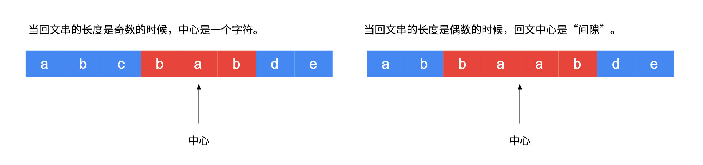

# [5. 最长回文子串](https://leetcode-cn.com/problems/longest-palindromic-substring/)

难度中等

给你一个字符串 `s`，找到 `s` 中最长的回文子串。

 

**示例 1：**

```
输入：s = "babad"
输出："bab"
解释："aba" 同样是符合题意的答案。
```

**示例 2：**

```
输入：s = "cbbd"
输出："bb"
```

**示例 3：**

```
输入：s = "a"
输出："a"
```

**示例 4：**

```
输入：s = "ac"
输出："a"
```

**提示：**

- `1 <= s.length <= 1000`
- `s` 仅由数字和英文字母（大写和/或小写）组成


## 解法1：动态规划

这道题比较烦人的是判断回文子串。因此需要一种能够快速判断原字符串的所有子串是否是回文子串的方法，于是想到了「动态规划」。

「动态规划」的一个关键的步骤是想清楚「状态如何转移」。事实上，「回文」天然具有「状态转移」性质。

- 一个回文去掉两头以后，剩下的部分依然是回文（这里暂不讨论边界情况）；
    依然从回文串的定义展开讨论：

- 如果一个字符串的头尾两个字符都不相等，那么这个字符串一定不是回文串；
- 如果一个字符串的头尾两个字符相等，才有必要继续判断下去。
    - 如果里面的子串是回文，整体就是回文串；
    - 如果里面的子串不是回文串，整体就不是回文串。

即：在头尾字符相等的情况下，里面子串的回文性质据定了整个子串的回文性质，这就是状态转移。因此可以把「状态」定义为原字符串的一个子串是否为回文子串。

### 思考步骤：

#### **第 1 步：定义状态**

dp[i] [j] 表示子串 s[i..j] 是否为回文子串，这里子串 s[i..j] 定义为左闭右闭区间，可以取到 s[i] 和 s[j]。

#### 第 2 步：思考状态转移方程

在这一步分类讨论（根据头尾字符是否相等），根据上面的分析得到：

```java
dp[i] [j] = (s[i] == s[j]) and ((right - left < = 2) || dp[i + 1] [j - 1])
//在charsArray[left] == charsArray[right] 的情况下，如果 right - left < = 2 || dp[left+1][right-1]是回文子串，则说明s[left ... right] 是会问窜
```


说明：

- 「动态规划」事实上是在填一张二维表格，由于构成子串，因此 i 和 j 的关系是 i <= j ，因此，只需要填这张表格对角线以上的部分。


- 看到 dp[i + 1] [j - 1] 就得考虑边界情况。


边界条件是：表达式 [i + 1, j - 1] 不构成区间，即长度严格小于 2，即 j - 1 - (i + 1) + 1 < 2 ，整理得 j - i < 3。

这个结论很显然：j - i < 3 等价于 j - i + 1 < 4，即当子串 s[i..j] 的长度等于 2 或者等于 3 的时候，其实只需要判断一下头尾两个字符是否相等就可以直接下结论了。

- 如果子串 s[i + 1..j - 1] 只有 1 个字符，即去掉两头，剩下中间部分只有 11 个字符，显然是回文；
- 如果子串 s[i + 1..j - 1] 为空串，那么子串 s[i, j] 一定是回文子串。

因此，在 s[i] == s[j] 成立和 j - i < 3 的前提下，直接可以下结论，dp[i] [j] = true，否则才执行状态转移。

#### 第 3 步：考虑初始化

初始化的时候，单个字符一定是回文串，因此把对角线先初始化为 true，即 dp[i] [i] = true 。

事实上，初始化的部分都可以省去。因为只有一个字符的时候一定是回文，dp[i] [i] 根本不会被其它状态值所参考。

#### 第 4 步：考虑输出

只要一得到 dp[i] [j] = true，就记录子串的长度和起始位置，没有必要截取，这是因为截取字符串也要消耗性能，记录此时的回文子串的「起始位置」和「回文长度」即可。

#### 第 5 步：考虑优化空间

因为在填表的过程中，只参考了左下方的数值。事实上可以优化，但是增加了代码编写和理解的难度，丢失可读和可解释性。在这里不优化空间。

注意事项：总是先得到小子串的回文判定，然后大子串才能参考小子串的判断结果，即填表顺序很重要。

大家能够可以自己动手，画一下表格，相信会对「动态规划」作为一种「表格法」有一个更好的理解。


### 代码

```java
public static String longestPalindrome(String s) {
    if(s.length() <= 1){
        return s;
    }
    int length = s.length();
    char[] charsArray = s.toCharArray();
    int l = 0;
    int r = 0;
    int dis = 0;
    boolean[][] dp = new boolean[length][length];
    for (int right = 0; right < length; right++) {
        for (int left = 0; left <= right; left++) {
            if(charsArray[left] == charsArray[right] && ((right - left <= 2) || dp[left+1][right-1])){
                if((right - left) > dis){
                    dis = right - left;
                    l = left;
                    r = right;
                }
                dp[left][right] = true;
            }
        }
    }

    s = s.substring(l,r+1);
    return s;
}
```


## 解法2：中心扩散

顾名思义，就是找到中心点，从两边扩散比较。

- 中心点分奇、偶，奇数的中心点在字符串的中心位置，偶数的中心点是一个空格
- 中心点不能是第一个字符，也不能是最后一个字符，这样就不能扩散了




```java
public class Solution {

    public String longestPalindrome(String s) {
        int len = s.length();
        if (len < 2) {
            return s;
        }
        int maxLen = 1;
        String res = s.substring(0, 1);
        // 中心位置枚举到 len - 2 即可
        for (int i = 0; i < len - 1; i++) {
            String oddStr = centerSpread(s, i, i);
            String evenStr = centerSpread(s, i, i + 1);
            String maxLenStr = oddStr.length() > evenStr.length() ? oddStr : evenStr;
            if (maxLenStr.length() > maxLen) {
                maxLen = maxLenStr.length();
                res = maxLenStr;
            }
        }
        return res;
    }

    private String centerSpread(String s, int left, int right) {
        // left = right 的时候，此时回文中心是一个字符，回文串的长度是奇数
        // right = left + 1 的时候，此时回文中心是一个空隙，回文串的长度是偶数
        int len = s.length();
        int i = left;
        int j = right;
        while (i >= 0 && j < len) {
            if (s.charAt(i) == s.charAt(j)) {
                i--;
                j++;
            } else {
                break;
            }
        }
        // 这里要小心，跳出 while 循环时，恰好满足 s.charAt(i) != s.charAt(j)，因此不能取 i，不能取 j
        return s.substring(i + 1, j);
    }
}

作者：liweiwei1419
链接：https://leetcode-cn.com/problems/longest-palindromic-substring/solution/zhong-xin-kuo-san-dong-tai-gui-hua-by-liweiwei1419/
来源：力扣（LeetCode）
著作权归作者所有。商业转载请联系作者获得授权，非商业转载请注明出处。
```


