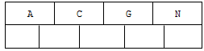

# 2. 索引

### 2.1 索引概述

MySQL官方对索引的定义为：索引（index）是帮助MySQL高效获取数据的数据结构（有序）。在数据之外，数据库系统还维护着满足特定查找算法的数据结构，这些数据结构以某种方式引用（指向）数据， 这样就可以在这些数据结构上实现高级查找算法，这种数据结构就是索引。如下面的==示意图==所示 : 


左边是数据表，一共有两列七条记录，最左边的是数据记录的物理地址（注意逻辑上相邻的记录在磁盘上也并不是一定物理相邻的）。为了加快Col2的查找，可以维护一个右边所示的二叉查找树，每个节点分别包含索引键值和一个指向对应数据记录物理地址的指针，这样就可以运用二叉查找快速获取到相应数据。

一般来说索引本身也很大，不可能全部存储在内存中，因此索引往往以索引文件的形式存储在磁盘上。索引是数据库中用来提高性能的最常用的工具。


### 2.2 索引优势劣势

优势

1） 类似于书籍的目录索引，提高数据检索的效率，降低数据库的IO成本。

2） 通过索引列对数据进行排序，降低数据排序的成本，降低CPU的消耗。

劣势

1） 实际上索引也是一张表，该表中保存了主键与索引字段，并指向实体类的记录，所以索引列也是要占用空间的。

2） 虽然索引大大提高了查询效率，同时却也降低更新表的速度，如对表进行INSERT、UPDATE、DELETE。因为更新表时，MySQL 不仅要保存数据，还要保存一下索引文件每次更新添加了索引列的字段，都会调整因为更新所带来的键值变化后的索引信息。


### 2.3 索引结构

索引是在MySQL的存储引擎层中实现的，而不是在服务器层实现的。所以每种存储引擎的索引都不一定完全相同，也不是所有的存储引擎都支持所有的索引类型的。MySQL目前提供了以下4种索引：

- BTREE 索引 ： 最常见的索引类型，大部分索引都支持 B 树索引。
- HASH 索引：只有Memory引擎支持 ， 使用场景简单 。
- R-tree 索引（空间索引）：空间索引是MyISAM引擎的一个特殊索引类型，主要用于地理空间数据类型，通常使用较少，不做特别介绍。
- Full-text （全文索引） ：全文索引也是MyISAM的一个特殊索引类型，主要用于全文索引，InnoDB从Mysql5.6版本开始支持全文索引。

<center><b>MyISAM、InnoDB、Memory三种存储引擎对各种索引类型的支持</b></center>

| 索引        | InnoDB引擎      | MyISAM引擎 | Memory引擎 |
| ----------- | --------------- | ---------- | ---------- |
| BTREE索引   | 支持            | 支持       | 支持       |
| HASH 索引   | 不支持          | 不支持     | 支持       |
| R-tree 索引 | 不支持          | 支持       | 不支持     |
| Full-text   | 5.6版本之后支持 | 支持       | 不支持     |

我们平常所说的索引，如果没有特别指明，都是指B+树（多路搜索树，并不一定是二叉的）结构组织的索引。其中聚集索引、复合索引、前缀索引、唯一索引默认都是使用 B+tree 索引，统称为 索引。


#### 2.3.1 BTREE 结构

BTree又叫多路平衡搜索树，一颗m叉的BTree特性如下：

- 树中每个节点最多包含m个孩子。
- 除根节点与叶子节点外，每个节点至少有[ceil(m/2)]个孩子。
- 若根节点不是叶子节点，则至少有两个孩子。
- 所有的叶子节点都在同一层。
- 每个非叶子节点由n个key与n+1个指针组成，其中[ceil(m/2)-1] <= n <= m-1 


以5叉BTree为例，key的数量：公式推导[ceil(m/2)-1] <= n <= m-1。所以 2 <= n <=4 。当n>4时，中间节点分裂到父节点，两边节点分裂。

插入 C N G A H E K Q M F W L T Z D P R X Y S 数据为例。

演变过程如下：

1). 插入前4个字母 C N G A 



2). 插入H，n>4，中间元素G字母向上分裂到新的节点


3). 插入E，K，Q不需要分裂


4). 插入M，中间元素M字母向上分裂到父节点G


5). 插入F，W，L，T不需要分裂


6). 插入Z，中间元素T向上分裂到父节点中 


7). 插入D，中间元素D向上分裂到父节点中。然后插入P，R，X，Y不需要分裂


8). 最后插入S，NPQR节点n>5，中间节点Q向上分裂，但分裂后父节点DGMT的n>5，中间节点M向上分裂


到此，该BTREE树就已经构建完成了， BTREE树 和 二叉树 相比， 查询数据的效率更高， 因为对于相同的数据量来说，BTREE的层级结构比二叉树小，因此搜索速度快。


#### 2.3.2 B+TREE 结构

B+Tree为BTree的变种，B+Tree与BTree的区别为：

1). n叉B+Tree最多含有n个key，而BTree最多含有n-1个key。

2). B+Tree的叶子节点保存所有的key信息，依key大小顺序排列。

3). 所有的非叶子节点都可以看作是key的索引部分。


由于B+Tree只有叶子节点保存key信息，查询任何key都要从root走到叶子。所以B+Tree的查询效率更加稳定。


#### 2.3.3 MySQL中的B+Tree

MySql索引数据结构对经典的B+Tree进行了优化。在原B+Tree的基础上，增加一个指向相邻叶子节点的链表指针，就形成了带有顺序指针的B+Tree，提高区间访问的性能。

MySQL中的 B+Tree 索引结构示意图: 


### 2.4 索引分类

1） 单值索引 ：即一个索引只包含单个列，一个表可以有多个单列索引

2） 唯一索引 ：索引列的值必须唯一，但允许有空值

3） 复合索引 ：即一个索引包含多个列

#### 1、聚集索引

聚集索引：指索引项的排序方式和表中数据记录排序方式一致的索引 

也就是说聚集索引的顺序就是数据的物理存储顺序。它会根据聚集索引键的顺序来存储表中的数据，即对表的数据按索引键的顺序进行排序，然后重新存储到磁盘上。因为数据在物理存放时只能有一种排列方式，所以一个表只能有一个聚集索引。


比如字典中，用‘拼音’查汉字，就是聚集索引。因为正文中字都是按照拼音排序的。而用‘偏旁部首’查汉字，就是非聚集索引，因为正文中的字并不是按照偏旁部首排序的，我们通过检字表得到正文中的字在索引中的映射，然后通过映射找到所需要的字。

聚集索引的使用场合为： 

　　a.查询命令的回传结果是以该字段为排序依据的； 

　　b.查询的结果返回一个区间的值； 

　　c.查询的结果返回某值相同的大量结果集。 

聚集索引会降低 insert，和update操作的性能，所以，是否使用聚集索引要全面衡量。 

#### 2、非聚集索引

索引顺序与物理存储顺序不同


非聚集索引的使用场合为： 

　　a.查询所获数据量较少时； 

　　b.某字段中的数据的唯一性比较高时；

非聚集索引必须是稠密索引

#### 3、聚簇索引

聚簇索引并不是一种单独的索引类型，而是一种数据存储方式。术语“聚族”表示数据行和相邻的键值紧凑的存储在一起。因为无法同时把数据行放在两个不同的地方，所以一个表只能有一个聚族索引。 


聚簇索引的优点 

可以把相关数据保存在一起。就好像在操场上战队，一个院系一个院系的站在一起，这样要找到一个人，就先找到他的院系，然后在他的院系里找到他就行了，而不是把学校里的所有人都遍历一遍

数据访问更快。聚簇索引将索引和数据保存在同一个B-Tree中，因此从聚族索引中获取数据通常比在非聚族索引中查找更快

#### 4、稠密索引

稠密索引：每个索引键值都对应有一个索引项


稠密索引能够比稀疏索引更快的定位一条记录。但是，稀疏索引相比于稠密索引的优点是：它所占空间更小，且插入和删除时的维护开销也小。

------

#### 5、稀疏索引

稀疏索引：相对于稠密索引，稀疏索引只为某些搜索码值建立索引记录；在搜索时，找到其最大的搜索码值小于或等于所查找记录的搜索码值的索引项，然后从该记录开始向后顺序查询直到找到为止。 


 

#### 接着结合mysql进行讲解：

mysql的两种数据存储方式，一种是InnoDB，一种是MyISAM。这两种存储都是基于B+树的存储方式，但是也有点不同。

`MyIsam 索引文件和数据文件是分离的，`索引文件仅保存数据记录的地址。主索引和辅助索引没有区别都是非聚集索引。索引页正常大小为1024字节，索引页存放在.MYI 文件中。MyISAM引擎使用B+Tree作为索引结构，`叶节点的data域存放的是数据记录的地址。`

InnoDB 也使用B+Tree作为索引结构，索引页大小16，`索引和表数据页共同存放在表空间中。`从InnoDB表数据存放方式可看出InnoDB表数据文件本身就是按B+Tree组织的一个索引结构，这棵树的叶节点data域保存了完整的数据记录。这个索引的key是数据表的主键，因此InnoDB表数据文件本身就是主索引。

InnoDB默认对主键建立聚簇索引。如果你不指定主键，InnoDB会用一个具有唯一且非空值的索引来代替。如果不存在这样的索引，InnoDB会定义一个隐藏的主键，然后对其建立聚簇索引。一般来说，InnoDB 会以聚簇索引的形式来存储实际的数据，它是其它二级索引的基础。

所以mysql innodb引擎的聚集索引、聚簇索引都默认是主键索引，如果没有指定主键，就是一个具有唯一且非空值的索引，如果不存在这样的索引，就是InnoDB自定义的隐藏主键索引，并且该索引是稠密索引。

### 2.5 索引语法

索引在创建表的时候，可以同时创建， 也可以随时增加新的索引。

准备环境:

```SQL
create database demo_01 default charset=utf8mb4;

use demo_01;

CREATE TABLE `city` (
  `city_id` int(11) NOT NULL AUTO_INCREMENT,
  `city_name` varchar(50) NOT NULL,
  `country_id` int(11) NOT NULL,
  PRIMARY KEY (`city_id`)
) ENGINE=InnoDB DEFAULT CHARSET=utf8;

CREATE TABLE `country` (
  `country_id` int(11) NOT NULL AUTO_INCREMENT,
  `country_name` varchar(100) NOT NULL,
  PRIMARY KEY (`country_id`)
) ENGINE=InnoDB DEFAULT CHARSET=utf8;


insert into `city` (`city_id`, `city_name`, `country_id`) values(1,'西安',1);
insert into `city` (`city_id`, `city_name`, `country_id`) values(2,'NewYork',2);
insert into `city` (`city_id`, `city_name`, `country_id`) values(3,'北京',1);
insert into `city` (`city_id`, `city_name`, `country_id`) values(4,'上海',1);

insert into `country` (`country_id`, `country_name`) values(1,'China');
insert into `country` (`country_id`, `country_name`) values(2,'America');
insert into `country` (`country_id`, `country_name`) values(3,'Japan');
insert into `country` (`country_id`, `country_name`) values(4,'UK');
```


#### 2.5.1 创建索引

语法 ： 	

```mysql
CREATE 	[UNIQUE|FULLTEXT|SPATIAL]  INDEX index_name 
[USING  index_type]
ON tbl_name(index_col_name,...)

index_col_name : column_name[(length)][ASC | DESC]
```

示例 ： 为city表中的city_name字段创建索引 ；


#### 2.5.2 查看索引

语法： 

```sql
show index  from  table_name;
show index  from  table_name\G; // 换一种格式查看
```

示例：查看city表中的索引信息；


#### 2.5.3 删除索引

语法 ：

```
DROP  INDEX  index_name  ON  tbl_name;
```

示例 ： 想要删除city表上的索引idx_city_name，可以操作如下：


#### 2.5.4 ALTER命令

```sql
1). alter  table  tb_name  add  primary  key(column_list); 

	该语句添加一个主键，这意味着索引值必须是唯一的，且不能为NULL
	
2). alter  table  tb_name  add  unique index_name(column_list);
	
	这条语句创建索引的值必须是唯一的（除了NULL外，NULL可能会出现多次）
	
3). alter  table  tb_name  add  index index_name(column_list);

	添加普通索引， 索引值可以出现多次。
	
4). alter  table  tb_name  add  fulltext  index_name(column_list);
	
	该语句指定了索引为FULLTEXT， 用于全文索引
	
```


### 2.6 索引设计原则

​	索引的设计可以遵循一些已有的原则，创建索引的时候请尽量考虑符合这些原则，便于提升索引的使用效率，更高效的使用索引。

- 对查询频次较高，且数据量比较大的表建立索引。

- 索引字段的选择，最佳候选列应当从where子句的条件中提取，如果where子句中的组合比较多，那么应当挑选最常用、过滤效果最好的列的组合。

- 使用唯一索引，区分度越高，使用索引的效率越高。

- 索引可以有效的提升查询数据的效率，但索引数量不是多多益善，索引越多，维护索引的代价自然也就水涨船高。对于插入、更新、删除等DML操作比较频繁的表来说，索引过多，会引入相当高的维护代价，降低DML操作的效率，增加相应操作的时间消耗。另外索引过多的话，MySQL也会犯选择困难病，虽然最终仍然会找到一个可用的索引，但无疑提高了选择的代价。

- 使用短索引，索引创建之后也是使用硬盘来存储的，因此提升索引访问的I/O效率，也可以提升总体的访问效率。假如构成索引的字段总长度比较短，那么在给定大小的存储块内可以存储更多的索引值，相应的可以有效的提升MySQL访问索引的I/O效率。

- 利用最左前缀，N个列组合而成的组合索引，那么相当于是创建了N个索引，如果查询时where子句中使用了组成该索引的前几个字段，那么这条查询SQL可以利用组合索引来提升查询效率。

  ```
  创建复合索引:
  
  	CREATE INDEX idx_name_email_status ON tb_seller(NAME,email,STATUS);
  
  就相当于
  	对name 创建索引 ;
  	对name , email 创建了索引 ;
  	对name , email, status 创建了索引 ;
  ```


