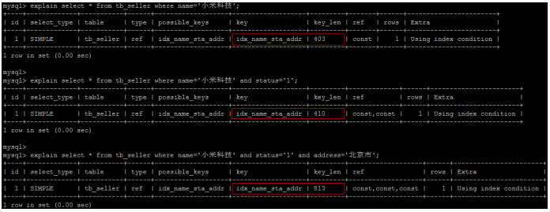
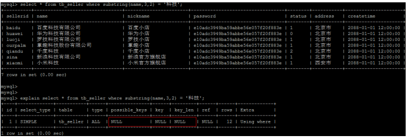
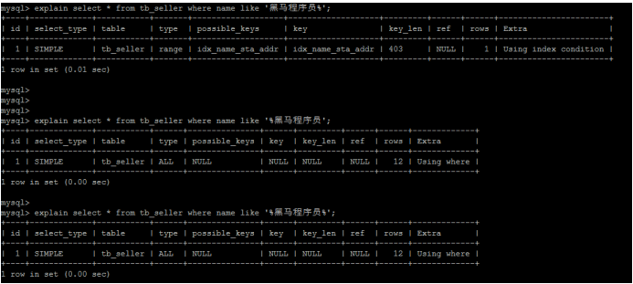
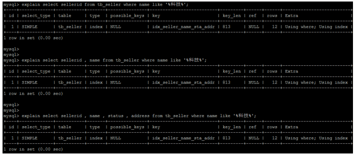
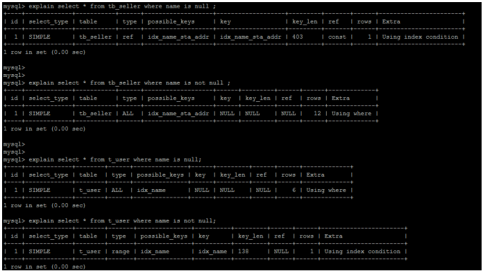

### 4. 索引的使用

索引是数据库优化最常用也是最重要的手段之一, 通过索引通常可以帮助用户解决大多数的MySQL的性能优化问题。


#### 4.1 验证索引提升查询效率

在我们准备的表结构tb_item 中， 一共存储了 300 万记录；

A. 根据ID查询 

```
select * from tb_item where id = 1999\G;
```


查询速度很快， 接近0s ， 主要的原因是因为id为主键， 有索引；


2). 根据 title 进行精确查询

```SQL
select * from tb_item where title = 'iphoneX 移动3G 32G941'\G; 
```


查看SQL语句的执行计划 ： 


处理方案 ， 针对title字段， 创建索引 ： 

```SQL
create index idx_item_title on tb_item(title);
```


索引创建完成之后，再次进行查询 ： 


通过explain ， 查看执行计划，执行SQL时使用了刚才创建的索引 


#### 4.2 索引的使用

##### 4.2.1 准备环境

```sql
create table `tb_seller` (
	`sellerid` varchar (100),
	`name` varchar (100),
	`nickname` varchar (50),
	`password` varchar (60),
	`status` varchar (1),
	`address` varchar (100),
	`createtime` datetime,
    primary key(`sellerid`)
)engine=innodb default charset=utf8mb4; 

insert into `tb_seller` (`sellerid`, `name`, `nickname`, `password`, `status`, `address`, `createtime`) values('alibaba','阿里巴巴','阿里小店','e10adc3949ba59abbe56e057f20f883e','1','北京市','2088-01-01 12:00:00');
insert into `tb_seller` (`sellerid`, `name`, `nickname`, `password`, `status`, `address`, `createtime`) values('baidu','百度科技有限公司','百度小店','e10adc3949ba59abbe56e057f20f883e','1','北京市','2088-01-01 12:00:00');
insert into `tb_seller` (`sellerid`, `name`, `nickname`, `password`, `status`, `address`, `createtime`) values('huawei','华为科技有限公司','华为小店','e10adc3949ba59abbe56e057f20f883e','0','北京市','2088-01-01 12:00:00');
insert into `tb_seller` (`sellerid`, `name`, `nickname`, `password`, `status`, `address`, `createtime`) values('itcast','传智播客教育科技有限公司','传智播客','e10adc3949ba59abbe56e057f20f883e','1','北京市','2088-01-01 12:00:00');
insert into `tb_seller` (`sellerid`, `name`, `nickname`, `password`, `status`, `address`, `createtime`) values('itheima','黑马程序员','黑马程序员','e10adc3949ba59abbe56e057f20f883e','0','北京市','2088-01-01 12:00:00');
insert into `tb_seller` (`sellerid`, `name`, `nickname`, `password`, `status`, `address`, `createtime`) values('luoji','罗技科技有限公司','罗技小店','e10adc3949ba59abbe56e057f20f883e','1','北京市','2088-01-01 12:00:00');
insert into `tb_seller` (`sellerid`, `name`, `nickname`, `password`, `status`, `address`, `createtime`) values('oppo','OPPO科技有限公司','OPPO官方旗舰店','e10adc3949ba59abbe56e057f20f883e','0','北京市','2088-01-01 12:00:00');
insert into `tb_seller` (`sellerid`, `name`, `nickname`, `password`, `status`, `address`, `createtime`) values('ourpalm','掌趣科技股份有限公司','掌趣小店','e10adc3949ba59abbe56e057f20f883e','1','北京市','2088-01-01 12:00:00');
insert into `tb_seller` (`sellerid`, `name`, `nickname`, `password`, `status`, `address`, `createtime`) values('qiandu','千度科技','千度小店','e10adc3949ba59abbe56e057f20f883e','2','北京市','2088-01-01 12:00:00');
insert into `tb_seller` (`sellerid`, `name`, `nickname`, `password`, `status`, `address`, `createtime`) values('sina','新浪科技有限公司','新浪官方旗舰店','e10adc3949ba59abbe56e057f20f883e','1','北京市','2088-01-01 12:00:00');
insert into `tb_seller` (`sellerid`, `name`, `nickname`, `password`, `status`, `address`, `createtime`) values('xiaomi','小米科技','小米官方旗舰店','e10adc3949ba59abbe56e057f20f883e','1','西安市','2088-01-01 12:00:00');
insert into `tb_seller` (`sellerid`, `name`, `nickname`, `password`, `status`, `address`, `createtime`) values('yijia','宜家家居','宜家家居旗舰店','e10adc3949ba59abbe56e057f20f883e','1','北京市','2088-01-01 12:00:00');


create index idx_seller_name_sta_addr on tb_seller(name,status,address);
```


##### 4.2.2 避免索引失效

1).  全值匹配 ，对索引中所有列都指定具体值。

改情况下，索引生效，执行效率高。

```sql
explain select * from tb_seller where name='小米科技' and status='1' and address='北京市'\G;
```


2). 最左前缀法则

如果索引了多列，要遵守最左前缀法则。指的是查询从索引的最左前列开始，并且不跳过索引中的列。


匹配最左前缀法则，走索引：



违法最左前缀法则 ， 索引失效：


如果符合最左法则，但是出现跳跃某一列，只有最左列索引生效：


3). 范围查询右边的列，不能使用索引 。


根据前面的两个字段name ， status 查询是走索引的， 但是最后一个条件address 没有用到索引。

4). 不要在索引列上进行运算操作， 索引将失效。



5). 字符串不加单引号，造成索引失效。


由于，在查询是，没有对字符串加单引号，MySQL的查询优化器，会自动的进行类型转换，造成索引失效。


6). 尽量使用覆盖索引，避免select *

尽量使用覆盖索引（只访问索引的查询（索引列完全包含查询列）），减少select * 。


如果查询列，超出索引列，也会降低性能。


```
TIP : 
	
    using index ：使用覆盖索引的时候就会出现

    using where：在查找使用索引的情况下，需要回表去查询所需的数据

    using index condition：查找使用了索引，但是需要回表查询数据

    using index ; using where：查找使用了索引，但是需要的数据都在索引列中能找到，所以不需要回表查询数据
```


7). 用or分割开的条件， 如果or前的条件中的列有索引，而后面的列中没有索引，那么涉及的索引都不会被用到。

示例，name字段是索引列 ， 而createtime不是索引列，中间是or进行连接是不走索引的 ： 

```sql
explain select * from tb_seller where name='黑马程序员' or createtime = '2088-01-01 12:00:00'\G;	
```


8).  以%开头的Like模糊查询，索引失效。

如果仅仅是尾部模糊匹配，索引不会失效。如果是头部模糊匹配，索引失效。



解决方案 ： 

通过覆盖索引来解决 



9). 如果MySQL评估使用索引比全表更慢，则不使用索引。


10). is  NULL ， is NOT NULL  <font color='red'>有时</font>索引失效。



11). in 走索引， not in 索引失效。


12). 单列索引和复合索引。

尽量使用复合索引，而少使用单列索引 。

创建复合索引 

```
create index idx_name_sta_address on tb_seller(name, status, address);

就相当于创建了三个索引 ： 
	name
	name + status
	name + status + address

```


创建单列索引 

```
create index idx_seller_name on tb_seller(name);
create index idx_seller_status on tb_seller(status);
create index idx_seller_address on tb_seller(address);
```

数据库会选择一个最优的索引（辨识度最高索引）来使用，并不会使用全部索引 。


#### 4.3 查看索引使用情况

```sql
show status like 'Handler_read%';	

show global status like 'Handler_read%';	
```


```
Handler_read_first：索引中第一条被读的次数。如果较高，表示服务器正执行大量全索引扫描（这个值越低越好）。

Handler_read_key：如果索引正在工作，这个值代表一个行被索引值读的次数，如果值越低，表示索引得到的性能改善不高，因为索引不经常使用（这个值越高越好）。

Handler_read_next ：按照键顺序读下一行的请求数。如果你用范围约束或如果执行索引扫描来查询索引列，该值增加。

Handler_read_prev：按照键顺序读前一行的请求数。该读方法主要用于优化ORDER BY ... DESC。

Handler_read_rnd ：根据固定位置读一行的请求数。如果你正执行大量查询并需要对结果进行排序该值较高。你可能使用了大量需要MySQL扫描整个表的查询或你的连接没有正确使用键。这个值较高，意味着运行效率低，应该建立索引来补救。

Handler_read_rnd_next：在数据文件中读下一行的请求数。如果你正进行大量的表扫描，该值较高。通常说明你的表索引不正确或写入的查询没有利用索引。
```