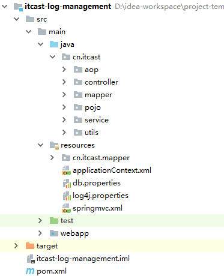
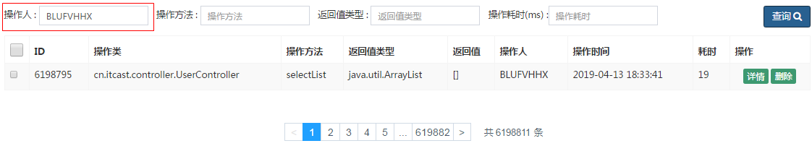

### 4. 综合案例

#### 4.1 需求分析

在业务系统中，需要记录当前业务系统的访问日志，该访问日志包含：操作人，操作时间，访问类，访问方法，请求参数，请求结果，请求结果类型，请求时长 等信息。记录详细的系统访问日志，主要便于对系统中的用户请求进行追踪，并且在系统 的管理后台可以查看到用户的访问记录。

记录系统中的日志信息，可以通过Spring 框架的AOP来实现。具体的请求处理流程，如下：

 


#### 4.2 搭建案例环境

##### 4.2.1 数据库表

```sql
CREATE DATABASE mysql_demo DEFAULT CHARACTER SET utf8mb4 ；

CREATE TABLE `brand` (
  `id` bigint(20) NOT NULL AUTO_INCREMENT,
  `name` varchar(255) DEFAULT NULL COMMENT '品牌名称',
  `first_char` varchar(1) DEFAULT NULL COMMENT '品牌首字母',
  PRIMARY KEY (`id`)
) ENGINE=InnoDB DEFAULT CHARSET=utf8;


CREATE TABLE `item` (
  `id` int(11) NOT NULL AUTO_INCREMENT COMMENT '商品id',
  `title` varchar(100) NOT NULL COMMENT '商品标题',
  `price` double(10,2) NOT NULL COMMENT '商品价格，单位为：元',
  `num` int(10) NOT NULL COMMENT '库存数量',
  `categoryid` bigint(10) NOT NULL COMMENT '所属类目，叶子类目',
  `status` varchar(1) DEFAULT NULL COMMENT '商品状态，1-正常，2-下架，3-删除',
  `sellerid` varchar(50) DEFAULT NULL COMMENT '商家ID',
  `createtime` datetime DEFAULT NULL COMMENT '创建时间',
  `updatetime` datetime DEFAULT NULL COMMENT '更新时间',
  PRIMARY KEY (`id`)
) ENGINE=InnoDB DEFAULT CHARSET=utf8 COMMENT='商品表';


CREATE TABLE `user` (
  `id` int(11) NOT NULL AUTO_INCREMENT,
  `username` varchar(45) NOT NULL,
  `password` varchar(96) NOT NULL,
  `name` varchar(45) NOT NULL,
  `birthday` datetime DEFAULT NULL,
  `sex` char(1) DEFAULT NULL,
  `email` varchar(45) DEFAULT NULL,
  `phone` varchar(45) DEFAULT NULL,
  `qq` varchar(32) DEFAULT NULL,
  PRIMARY KEY (`id`)
) ENGINE=InnoDB DEFAULT CHARSET=utf8;


CREATE TABLE `operation_log` (
  `id` bigint(20) NOT NULL AUTO_INCREMENT COMMENT 'ID',
  `operate_class` varchar(200) DEFAULT NULL COMMENT '操作类',
  `operate_method` varchar(200) DEFAULT NULL COMMENT '操作方法',
  `return_class` varchar(200) DEFAULT NULL COMMENT '返回值类型',
  `operate_user` varchar(20) DEFAULT NULL COMMENT '操作用户',
  `operate_time` varchar(20) DEFAULT NULL COMMENT '操作时间',
  `param_and_value` varchar(500) DEFAULT NULL COMMENT '请求参数名及参数值',
  `cost_time` bigint(20) DEFAULT NULL COMMENT '执行方法耗时, 单位 ms',
  `return_value` varchar(200) DEFAULT NULL COMMENT '返回值',
  PRIMARY KEY (`id`)
) ENGINE=InnoDB  DEFAULT CHARSET=utf8mb4;

```


##### 4.2.2 pom.xml 

```xml
<properties>
  <project.build.sourceEncoding>UTF-8</project.build.sourceEncoding>
  <maven.compiler.source>1.7</maven.compiler.source>
  <maven.compiler.target>1.7</maven.compiler.target>

  <project.build.sourceEncoding>UTF-8</project.build.sourceEncoding>
  <maven.compiler.source>1.8</maven.compiler.source>
  <maven.compiler.target>1.8</maven.compiler.target>
  <spring.version>5.0.2.RELEASE</spring.version>
  <slf4j.version>1.6.6</slf4j.version>
  <log4j.version>1.2.12</log4j.version>
  <mybatis.version>3.4.5</mybatis.version>
</properties>

<dependencies> <!-- spring -->
  <dependency>
    <groupId>org.aspectj</groupId>
    <artifactId>aspectjweaver</artifactId>
    <version>1.6.8</version>
  </dependency>

  <dependency>
    <groupId>org.projectlombok</groupId>
    <artifactId>lombok</artifactId>
    <version>1.16.16</version>
  </dependency>

  <dependency>
    <groupId>org.springframework</groupId>
    <artifactId>spring-context</artifactId>
    <version>${spring.version}</version>
  </dependency>

  <dependency>
    <groupId>org.springframework</groupId>
    <artifactId>spring-context-support</artifactId>
    <version>${spring.version}</version>
  </dependency>

  <dependency>
    <groupId>org.springframework</groupId>
    <artifactId>spring-orm</artifactId>
    <version>${spring.version}</version>
  </dependency>

  <dependency>
    <groupId>org.springframework</groupId>
    <artifactId>spring-test</artifactId>
    <version>${spring.version}</version>
  </dependency>

  <dependency>
    <groupId>org.springframework</groupId>
    <artifactId>spring-webmvc</artifactId>
    <version>${spring.version}</version>
  </dependency>

  <dependency>
    <groupId>org.springframework</groupId>
    <artifactId>spring-tx</artifactId>
    <version>${spring.version}</version>
  </dependency>

  <dependency>
    <groupId>junit</groupId>
    <artifactId>junit</artifactId>
    <version>4.12</version>
    <scope>test</scope>
  </dependency>

  <dependency>
    <groupId>javax.servlet</groupId>
    <artifactId>javax.servlet-api</artifactId>
    <version>3.1.0</version>
    <scope>provided</scope>
  </dependency>

  <dependency>
    <groupId>javax.servlet.jsp</groupId>
    <artifactId>jsp-api</artifactId>
    <version>2.0</version>
    <scope>provided</scope>
  </dependency>


  <dependency>
    <groupId>log4j</groupId>
    <artifactId>log4j</artifactId>
    <version>${log4j.version}</version>
  </dependency>

  <dependency>
    <groupId>org.mybatis</groupId>
    <artifactId>mybatis</artifactId>
    <version>${mybatis.version}</version>
  </dependency>

  <dependency>
    <groupId>org.mybatis</groupId>
    <artifactId>mybatis-spring</artifactId>
    <version>1.3.0</version>
  </dependency>

  <dependency>
    <groupId>c3p0</groupId>
    <artifactId>c3p0</artifactId>
    <version>0.9.1.2</version>
  </dependency>

  <dependency>
    <groupId>mysql</groupId>
    <artifactId>mysql-connector-java</artifactId>
    <version>5.1.5</version>
  </dependency>

  <dependency>
    <groupId>com.fasterxml.jackson.core</groupId>
    <artifactId>jackson-core</artifactId>
    <version>2.9.0</version>
  </dependency>

  <dependency>
    <groupId>com.fasterxml.jackson.core</groupId>
    <artifactId>jackson-databind</artifactId>
    <version>2.9.0</version>
  </dependency>

  <dependency>
    <groupId>com.fasterxml.jackson.core</groupId>
    <artifactId>jackson-annotations</artifactId>
    <version>2.9.0</version>
  </dependency>
</dependencies>


 <build>
   <plugins>
     <plugin>
       <groupId>org.apache.tomcat.maven</groupId>
       <artifactId>tomcat7-maven-plugin</artifactId>
       <version>2.2</version>
       <configuration>
         <port>8080</port>
         <path>/</path>
         <uriEncoding>utf-8</uriEncoding>
       </configuration>
     </plugin>
   </plugins>
 </build>
```

##### 4.2.3 web.xml

```xml
<?xml version="1.0" encoding="UTF-8"?>
<web-app xmlns:xsi="http://www.w3.org/2001/XMLSchema-instance" xmlns="http://java.sun.com/xml/ns/javaee"
       xsi:schemaLocation="http://java.sun.com/xml/ns/javaee http://java.sun.com/xml/ns/javaee/web-app_2_5.xsd"
       version="2.5">

    <!-- 解决post乱码 -->
    <filter>
        <filter-name>CharacterEncodingFilter</filter-name>
        <filter-class>org.springframework.web.filter.CharacterEncodingFilter</filter-class>
        <init-param>
            <param-name>encoding</param-name>
            <param-value>utf-8</param-value>
        </init-param>
        <init-param>
            <param-name>forceEncoding</param-name>
            <param-value>true</param-value>
        </init-param>
    </filter>
    <filter-mapping>
        <filter-name>CharacterEncodingFilter</filter-name>
        <url-pattern>/*</url-pattern>
    </filter-mapping>

    <context-param>
        <param-name>contextConfigLocation</param-name>
        <param-value>classpath:applicationContext.xml</param-value>
    </context-param>
    <listener>
        <listener-class>org.springframework.web.context.ContextLoaderListener</listener-class>
    </listener>


    <servlet>
        <servlet-name>springmvc</servlet-name>
        <servlet-class>org.springframework.web.servlet.DispatcherServlet</servlet-class>
        <!-- 指定加载的配置文件 ，通过参数contextConfigLocation加载-->
        <init-param>
            <param-name>contextConfigLocation</param-name>
            <param-value>classpath:springmvc.xml</param-value>
        </init-param>
    </servlet>
    <servlet-mapping>
        <servlet-name>springmvc</servlet-name>
        <url-pattern>*.do</url-pattern>
    </servlet-mapping>

    <welcome-file-list>
      <welcome-file>log-datalist.html</welcome-file>
    </welcome-file-list>
</web-app>
```

##### 4.2.4 db.properties

```properties
jdbc.driver=com.mysql.jdbc.Driver
jdbc.url=jdbc:mysql://192.168.142.128:3306/mysql_demo
jdbc.username=root
jdbc.password=itcast
```

##### 4.2.5 applicationContext.xml

```xml
<?xml version="1.0" encoding="UTF-8"?>
<beans xmlns="http://www.springframework.org/schema/beans"
       xmlns:xsi="http://www.w3.org/2001/XMLSchema-instance"
       xmlns:aop="http://www.springframework.org/schema/aop"
       xmlns:tx="http://www.springframework.org/schema/tx"
       xmlns:context="http://www.springframework.org/schema/context"
	   xsi:schemaLocation="http://www.springframework.org/schema/beans http://www.springframework.org/schema/beans/spring-beans.xsd
                           http://www.springframework.org/schema/tx http://www.springframework.org/schema/tx/spring-tx.xsd
                            http://www.springframework.org/schema/aop http://www.springframework.org/schema/aop/spring-aop.xsd
                            http://www.springframework.org/schema/context http://www.springframework.org/schema/context/spring-context.xsd">

    <!-- 加载配置文件 -->
    <context:property-placeholder location="classpath:db.properties"/>

    <!-- 配置 spring 创建容器时要扫描的包 -->
    <context:component-scan base-package="cn.itcast">
        <context:exclude-filter type="annotation" expression="org.springframework.stereotype.Controller">	
        </context:exclude-filter>
    </context:component-scan>

    <!-- 配置 MyBatis 的 Session 工厂 -->
    <bean id="sqlSessionFactory" class="org.mybatis.spring.SqlSessionFactoryBean">
        <property name="dataSource" ref="dataSource"/>
        <property name="typeAliasesPackage" value="cn.itcast.pojo"/>
     </bean>

    <!-- 配置数据源 -->
    <bean id="dataSource" class="com.mchange.v2.c3p0.ComboPooledDataSource">
        <property name="driverClass" value="${jdbc.driver}"></property>
        <property name="jdbcUrl" value="${jdbc.url}"></property>
        <property name="user" value="${jdbc.username}"></property>
        <property name="password" value="${jdbc.password}"></property>
    </bean>

    <!-- 配置 Mapper 扫描器 -->
    <bean class="org.mybatis.spring.mapper.MapperScannerConfigurer">
        <property name="basePackage" value="cn.itcast.mapper"/>
    </bean>

    <!-- 配置事务管理器 -->
    <bean id="transactionManager" class="org.springframework.jdbc.datasource.DataSourceTransactionManager">
        <property name="dataSource" ref="dataSource"/>
    </bean>

    <!-- 配置事务的注解驱动 -->
    <tx:annotation-driven transaction-manager="transactionManager"></tx:annotation-driven>
</beans>
```

##### 4.2.6 springmvc.xml

```xml
<?xml version="1.0" encoding="UTF-8"?>
<beans xmlns="http://www.springframework.org/schema/beans"
       xmlns:mvc="http://www.springframework.org/schema/mvc"
       xmlns:context="http://www.springframework.org/schema/context"
       xmlns:aop="http://www.springframework.org/schema/aop"
       xmlns:xsi="http://www.w3.org/2001/XMLSchema-instance"
       xsi:schemaLocation="http://www.springframework.org/schema/beans
            http://www.springframework.org/schema/beans/spring-beans.xsd
            http://www.springframework.org/schema/mvc
            http://www.springframework.org/schema/mvc/spring-mvc.xsd
            http://www.springframework.org/schema/aop
            http://www.springframework.org/schema/aop/spring-aop.xsd
            http://www.springframework.org/schema/context
            http://www.springframework.org/schema/context/spring-context.xsd">

    <context:component-scan base-package="cn.itcast.controller"></context:component-scan>

    <mvc:annotation-driven></mvc:annotation-driven>

    <aop:aspectj-autoproxy />

</beans>
```

##### 4.2.7 导入基础工程

 


#### 4.3 通过AOP记录操作日志

##### 4.3.1 自定义注解

通过自定义注解，来标示方法需不需要进行记录日志，如果该方法在访问时需要记录日志，则在该方法上标示该注解既可。

```java
@Inherited
@Documented
@Target(ElementType.METHOD)
@Retention(RetentionPolicy.RUNTIME)
public @interface OperateLog {
}
```

##### 4.3.2 定义通知类

```java
@Component
@Aspect
public class OperateAdvice {
   
   private static Logger log = Logger.getLogger(OperateAdvice.class);
   
   @Autowired
   private OperationLogService operationLogService;
   

   @Around("execution(* cn.itcast.controller.*.*(..)) && @annotation(operateLog)")
   public Object insertLogAround(ProceedingJoinPoint pjp , OperateLog operateLog) throws Throwable{
      System.out.println(" ************************ 记录日志 [start]  ****************************** ");
      
      OperationLog op = new OperationLog();
      
      DateFormat sdf = new SimpleDateFormat("yyyy-MM-dd HH:mm:ss");

      op.setOperateTime(sdf.format(new Date()));
      op.setOperateUser(DataUtils.getRandStr(8));
      
      op.setOperateClass(pjp.getTarget().getClass().getName());
      op.setOperateMethod(pjp.getSignature().getName());
      
      //获取方法调用时传递的参数
      Object[] args = pjp.getArgs();
      op.setParamAndValue(Arrays.toString(args));

      long start_time = System.currentTimeMillis();

      //放行
      Object object = pjp.proceed();

      long end_time = System.currentTimeMillis();
      op.setCostTime(end_time - start_time);

      if(object != null){
         op.setReturnClass(object.getClass().getName());
         op.setReturnValue(object.toString());
      }else{
         op.setReturnClass("java.lang.Object");
         op.setParamAndValue("void");
      }

      log.error(JsonUtils.obj2JsonString(op));

      operationLogService.insert(op);
      
      System.out.println(" ************************** 记录日志 [end]  *************************** ");
      
      return object;
   }
   
}
```

##### 4.3.3 方法上加注解

在需要记录日志的方法上加上注解@OperateLog。

```java
@OperateLog
@RequestMapping("/insert")
public Result insert(@RequestBody Brand brand){
    try {
        brandService.insert(brand);
        return new Result(true,"操作成功");
    } catch (Exception e) {
        e.printStackTrace();
        return new Result(false,"操作失败");
    }
}
```


#### 4.4 日志查询后端代码实现

##### 4.4.1 Mapper接口

```java
public interface OperationLogMapper {

    public void insert(OperationLog operationLog);

    public List<OperationLog> selectListByCondition(Map dataMap);

    public Long countByCondition(Map dataMap);

}
```

##### 4.4.2 Mapper.xml 映射配置文件

```xml
<?xml version="1.0" encoding="UTF-8" ?>
<!DOCTYPE mapper PUBLIC "-//mybatis.org//DTD Mapper 3.0//EN" "http://mybatis.org/dtd/mybatis-3-mapper.dtd" >
<mapper namespace="cn.itcast.mapper.OperationLogMapper" >

    <insert id="insert" parameterType="operationLog">
        INSERT INTO operation_log(id,return_value,return_class,operate_user,operate_time,param_and_value,
        operate_class,operate_method,cost_time)
      VALUES(NULL,#{returnValue},#{returnClass},#{operateUser},#{operateTime},#{paramAndValue},
        #{operateClass},#{operateMethod},#{costTime})
    </insert>

    <select id="selectListByCondition" parameterType="map" resultType="operationLog">
      select
        id ,
        operate_class as operateClass ,
        operate_method as operateMethod,
        return_class as returnClass,
        operate_user as operateUser,
        operate_time as operateTime,
        param_and_value as paramAndValue,
        cost_time as costTime,
        return_value as returnValue
      from operation_log
      <include refid="oplog_where"/>
      limit #{start},#{size}
    </select>


    <select id="countByCondition" resultType="long" parameterType="map">
        select count(*) from operation_log
        <include refid="oplog_where"/>
    </select>


    <sql id="oplog_where">
        <where>
            <if test="operateClass != null and operateClass != '' ">
                and operate_class = #{operateClass}
            </if>
            <if test="operateMethod != null and operateMethod != '' ">
                and operate_method = #{operateMethod}
            </if>
            <if test="returnClass != null and returnClass != '' ">
                and return_class = #{returnClass}
            </if>
            <if test="costTime != null">
                and cost_time =  #{costTime}
            </if>
        </where>
    </sql>

</mapper>
```

##### 4.4.3 Service

```java
@Service
@Transactional
public class OperationLogService {

    //private static Logger logger = Logger.getLogger(OperationLogService.class);

    @Autowired
    private OperationLogMapper operationLogMapper;

    //插入数据
    public void insert(OperationLog operationLog){
        operationLogMapper.insert(operationLog);
    }

    //根据条件查询
    public PageResult selectListByCondition(Map dataMap, Integer pageNum , Integer pageSize){

       if(paramMap ==null){
            paramMap = new HashMap();
        }
        paramMap.put("start" , (pageNum-1)*rows);
        paramMap.put("rows",rows);

        Object costTime = paramMap.get("costTime");
        if(costTime != null){
            if("".equals(costTime.toString())){
                paramMap.put("costTime",null);
            }else{
                paramMap.put("costTime",new Long(paramMap.get("costTime").toString()));
            }
        }

        System.out.println(dataMap);


        long countStart = System.currentTimeMillis();
        Long count = operationLogMapper.countByCondition(dataMap);
        long countEnd = System.currentTimeMillis();
        System.out.println("Count Cost Time : " + (countEnd-countStart)+" ms");


        List<OperationLog> list = operationLogMapper.selectListByCondition(dataMap);
        long queryEnd = System.currentTimeMillis();
        System.out.println("Query Cost Time : " + (queryEnd-countEnd)+" ms");


        return new PageResult(count,list);

    }

}
```

##### 4.4.4 Controller

```java
@RestController
@RequestMapping("/operationLog")
public class OperationLogController {

    @Autowired
    private OperationLogService operationLogService;

    @RequestMapping("/findList")
    public PageResult findList(@RequestBody Map dataMap, Integer pageNum , Integer pageSize){
        PageResult page = operationLogService.selectListByCondition(dataMap, pageNum, pageSize);
        return page;
    }

}
```


#### 4.5 日志查询前端代码实现

前端代码使用 BootStrap + AdminLTE 进行布局， 使用Vuejs 进行视图层展示。

##### 4.5.1 js

```html
<script>
   var vm = new Vue({
       el: '#app',
       data: {
           dataList:[],
           searchEntity:{
               operateClass:'',
               operateMethod:'',
               returnClass:'',
               costTime:''
           },

           page: 1,  //显示的是哪一页
           pageSize: 10, //每一页显示的数据条数
           total: 150, //记录总数
           maxPage:8  //最大页数
       },
       methods: {
           pageHandler: function (page) {
               this.page = page;
               this.search();
           },

           search: function () {
               var _this = this;
               this.showLoading();
               axios.post('/operationLog/findList.do?pageNum=' + _this.page + "&pageSize=" + _this.pageSize, _this.searchEntity).then(function (response) {
                   if (response) {
                       _this.dataList = response.data.dataList;
                       _this.total = response.data.total;
                       _this.hideLoading();
                   }
               })
           },

           showLoading: function () {
               $('#loadingModal').modal({backdrop: 'static', keyboard: false});
           },

           hideLoading: function () {
               $('#loadingModal').modal('hide');
           },
       },

       created:function(){
           this.pageHandler(1);
       }
   });

</script>
```

##### 4.5.2 列表数据展示

```html
<tr v-for="item in dataList">
    <td><input name="ids" type="checkbox"></td>
    <td>{{item.id}}</td>
    <td>{{item.operateClass}}</td>
    <td>{{item.operateMethod}}</td>
    <td>{{item.returnClass}}</td>
    <td>{{item.returnValue}}</td>
    <td>{{item.operateUser}}</td>
    <td>{{item.operateTime}}</td>
    <td>{{item.costTime}}</td>
    <td class="text-center">
        <button type="button" class="btn bg-olive btn-xs">详情</button>
        <button type="button" class="btn bg-olive btn-xs">删除</button>
    </td>
</tr>
```

4.5.3 分页插件

```html
<div class="wrap" id="wrap">
    <zpagenav v-bind:page="page" v-bind:page-size="pageSize" v-bind:total="total"
              v-bind:max-page="maxPage"  v-on:pagehandler="pageHandler">
    </zpagenav>
</div>
```

#### 4.6 联调测试

可以通过postman来访问业务系统，再查看数据库中的日志信息，验证能不能将用户的访问日志记录下来。

 


#### 4.7 分析性能问题

系统中用户访问日志的数据量，随着时间的推移，这张表的数据量会越来越大，因此我们需要根据业务需求，来对日志查询模块的性能进行优化。

1） 分页查询优化

由于在进行日志查询时，是进行分页查询，那也就意味着，在查看时，至少需要查询两次：

A. 查询符合条件的总记录数。--> count 操作

B. 查询符合条件的列表数据。--> 分页查询 limit 操作

通常来说，count() 都需要扫描大量的行（意味着需要访问大量的数据）才能获得精确的结果，因此是很难对该SQL进行优化操作的。如果需要对count进行优化，可以采用另外一种思路，可以增加汇总表，或者redis缓存来专门记录该表对应的记录数，这样的话，就可以很轻松的实现汇总数据的查询，而且效率很高，但是这种统计并不能保证百分之百的准确 。对于数据库的操作，“快速、精确、实现简单”，三者永远只能满足其二，必须舍掉其中一个。

2） 条件查询优化

针对于条件查询,需要对查询条件,及排序字段建立索引。

3） 读写分离

通过主从复制集群，来完成读写分离，使写操作走主节点， 而读操作，走从节点。

4） MySQL服务器优化

5） 应用优化


#### 4.8 性能优化 - 分页

##### 4.8.1 优化count

创建一张表用来记录日志表的总数据量：

```SQL
create table log_counter(
	logcount bigint not null
)engine = innodb default CHARSET = utf8;
```

在每次插入数据之后，更新该表 ：

```xml
<update id="updateLogCounter" >
    update log_counter set logcount = logcount + 1
</update>
```

在进行分页查询时, 获取总记录数，从该表中查询既可。

```xml
<select id="countLogFromCounter" resultType="long">
    select logcount from log_counter limit 1
</select>
```


##### 4.8.2 优化 limit

在进行分页时，一般通过创建覆盖索引，能够比较好的提高性能。一个非常常见，而又非常头疼的分页场景就是 "limit 1000000,10" ，此时MySQL需要搜索出前1000010 条记录后，仅仅需要返回第 1000001 到 1000010 条记录，前1000000 记录会被抛弃，查询代价非常大。 

 

当点击比较靠后的页码时，就会出现这个问题，查询效率非常慢。

优化SQL：

```sql
select * from operation_log limit 3000000 , 10;
```

将上述SQL优化为 : 

```SQL
select * from operation_log t , (select id from operation_log order by id limit 3000000,10) b where t.id = b.id ;
```

```xml
<select id="selectListByCondition" parameterType="map" resultType="operationLog">
  select
    id ,
    operate_class as operateClass ,
    operate_method as operateMethod,
    return_class as returnClass,
    operate_user as operateUser,
    operate_time as operateTime,
    param_and_value as paramAndValue,
    cost_time as costTime,
    return_value as returnValue
  from operation_log t,
    
  (select id from operation_log 
  <where>
    <include refid="oplog_where"/>
  </where>
  order by id limit #{start},#{rows}) b  where t.id = b.id  
</select>
```


#### 4.9 性能优化 - 索引



当根据操作人进行查询时， 查询的效率很低，耗时比较长。原因就是因为在创建数据库表结构时，并没有针对于 操作人 字段建立索引。

```SQL
CREATE INDEX idx_user_method_return_cost ON operation_log(operate_user,operate_method,return_class,cost_time);
```

同上 ， 为了查询效率高，我们也需要对 操作方法、返回值类型、操作耗时 等字段进行创建索引，以提高查询效率。

```SQL
CREATE INDEX idx_optlog_method_return_cost ON operation_log(operate_method,return_class,cost_time);

CREATE INDEX idx_optlog_return_cost ON operation_log(return_class,cost_time);

CREATE INDEX idx_optlog_cost ON operation_log(cost_time);

```


#### 4.10 性能优化 - 排序

在查询数据时，如果业务需求中需要我们对结果内容进行了排序处理 , 这个时候,我们还需要对排序的字段建立适当的索引, 来提高排序的效率 。


#### 4.11 性能优化 - 读写分离

##### 4.11.1 概述

在Mysql主从复制的基础上，可以使用读写分离来降低单台Mysql节点的压力，从而来提高访问效率，读写分离的架构如下：

 

对于读写分离的实现，可以通过Spring AOP 来进行动态的切换数据源，进行操作 ：

##### 4.11.2 实现方式

db.properties

```properties
jdbc.write.driver=com.mysql.jdbc.Driver
jdbc.write.url=jdbc:mysql://192.168.142.128:3306/mysql_demo
jdbc.write.username=root
jdbc.write.password=itcast

jdbc.read.driver=com.mysql.jdbc.Driver
jdbc.read.url=jdbc:mysql://192.168.142.129:3306/mysql_demo
jdbc.read.username=root
jdbc.read.password=itcast
```

applicationContext-datasource.xml

```xml
<?xml version="1.0" encoding="UTF-8"?>
<beans xmlns="http://www.springframework.org/schema/beans"
       xmlns:xsi="http://www.w3.org/2001/XMLSchema-instance"
       xmlns:aop="http://www.springframework.org/schema/aop"
       xmlns:tx="http://www.springframework.org/schema/tx"
       xmlns:context="http://www.springframework.org/schema/context"
       xsi:schemaLocation="http://www.springframework.org/schema/beans http://www.springframework.org/schema/beans/spring-beans.xsd
        http://www.springframework.org/schema/tx http://www.springframework.org/schema/tx/spring-tx.xsd
        http://www.springframework.org/schema/aop http://www.springframework.org/schema/aop/spring-aop.xsd
        http://www.springframework.org/schema/context http://www.springframework.org/schema/context/spring-context.xsd">


    <!-- 配置数据源 - Read -->
    <bean id="readDataSource" class="com.mchange.v2.c3p0.ComboPooledDataSource" destroy-method="close"  lazy-init="true">
        <property name="driverClass" value="${jdbc.read.driver}"></property>
        <property name="jdbcUrl" value="${jdbc.read.url}"></property>
        <property name="user" value="${jdbc.read.username}"></property>
        <property name="password" value="${jdbc.read.password}"></property>
    </bean>


    <!-- 配置数据源 - Write -->
    <bean id="writeDataSource" class="com.mchange.v2.c3p0.ComboPooledDataSource"  destroy-method="close"  lazy-init="true">
        <property name="driverClass" value="${jdbc.write.driver}"></property>
        <property name="jdbcUrl" value="${jdbc.write.url}"></property>
        <property name="user" value="${jdbc.write.username}"></property>
        <property name="password" value="${jdbc.write.password}"></property>
    </bean>


    <!-- 配置动态分配的读写 数据源 -->
    <bean id="dataSource" class="cn.itcast.aop.datasource.ChooseDataSource" lazy-init="true">
        <property name="targetDataSources">
            <map key-type="java.lang.String" value-type="javax.sql.DataSource">
                <entry key="write" value-ref="writeDataSource"/>
                <entry key="read" value-ref="readDataSource"/>
            </map>
        </property>

        <property name="defaultTargetDataSource" ref="writeDataSource"/>

        <property name="methodType">
            <map key-type="java.lang.String">
                <entry key="read" value=",get,select,count,list,query,find"/>
                <entry key="write" value=",add,create,update,delete,remove,insert"/>
            </map>
        </property>
    </bean>

</beans>
```

ChooseDataSource

```java
public class ChooseDataSource extends AbstractRoutingDataSource {

    public static Map<String, List<String>> METHOD_TYPE_MAP = new HashMap<String, List<String>>();

    /**
     * 实现父类中的抽象方法，获取数据源名称
     * @return
     */
    protected Object determineCurrentLookupKey() {
        return DataSourceHandler.getDataSource();
    }

    // 设置方法名前缀对应的数据源
    public void setMethodType(Map<String, String> map) {
        for (String key : map.keySet()) {
            List<String> v = new ArrayList<String>();
            String[] types = map.get(key).split(",");
            for (String type : types) {
                if (!StringUtils.isEmpty(type)) {
                    v.add(type);
                }
            }
            METHOD_TYPE_MAP.put(key, v);
        }
        System.out.println("METHOD_TYPE_MAP : "+METHOD_TYPE_MAP);
    }
}
```

DataSourceHandler

```java
public class DataSourceHandler {

    // 数据源名称
    public static final ThreadLocal<String> holder = new ThreadLocal<String>();

    /**
     * 在项目启动的时候将配置的读、写数据源加到holder中
     */
    public static void putDataSource(String datasource) {
        holder.set(datasource);
    }

    /**
     * 从holer中获取数据源字符串
     */
    public static String getDataSource() {
        return holder.get();
    }
}
```

DataSourceAspect

```java
@Aspect
@Component
@Order(-9999)
@EnableAspectJAutoProxy(proxyTargetClass = true)
public class DataSourceAspect {

    protected Logger logger = LoggerFactory.getLogger(this.getClass());

    /**
     * 配置前置通知,使用在方法aspect()上注册的切入点
     */
    @Before("execution(* cn.itcast.service.*.*(..))")
    @Order(-9999)
    public void before(JoinPoint point) {
        
        String className = point.getTarget().getClass().getName();
        String method = point.getSignature().getName();
        logger.info(className + "." + method + "(" + Arrays.asList(point.getArgs())+ ")");

        try {
            for (String key : ChooseDataSource.METHOD_TYPE_MAP.keySet()) {
                for (String type : ChooseDataSource.METHOD_TYPE_MAP.get(key)) {
                    if (method.startsWith(type)) {
                        System.out.println("key : " + key);
                        DataSourceHandler.putDataSource(key);
                        break;
                    }
                }
            }
        } catch (Exception e) {
            e.printStackTrace();
        }

    }
}
```

通过 @Order(-9999) 注解来控制事务管理器, 与该通知类的加载顺序 , 需要让通知类 , 先加载 , 来判定使用哪个数据源 .


##### 4.11.3 验证

在主库和从库中，执行如下SQL语句，来查看是否读的时候， 从从库中读取 ； 写入操作的时候，是否写入到主库。

```sql
show status like 'Innodb_rows_%' ;
```

 


##### 4.11.4 原理


#### 4.12 性能优化 - 应用优化

##### 4.12.1 缓存

可以在业务系统中使用redis来做缓存，缓存一些基础性的数据，来降低关系型数据库的压力，提高访问效率。


##### 4.12.2 全文检索

如果业务系统中的数据量比较大（达到千万级别），这个时候，如果再对数据库进行查询，特别是进行分页查询，速度将变得很慢（因为在分页时首先需要count求合计数），为了提高访问效率，这个时候，可以考虑加入Solr 或者 ElasticSearch全文检索服务，来提高访问效率。


##### 4.13.3 非关系数据库

也可以考虑将非核心（重要）数据，存在 MongoDB 中，这样可以提高插入以及查询的效率。


