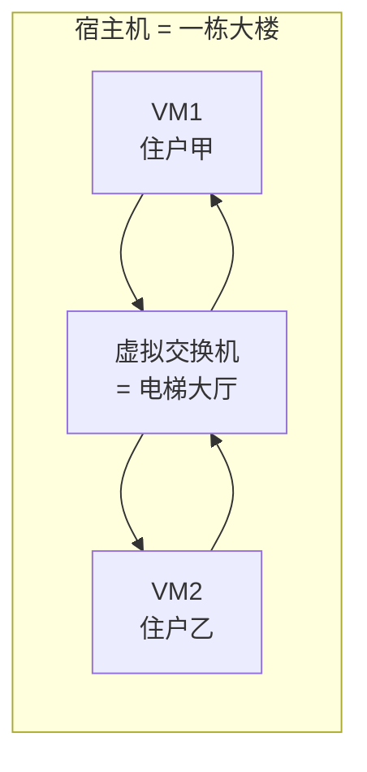
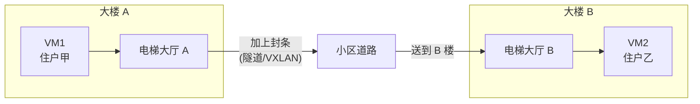
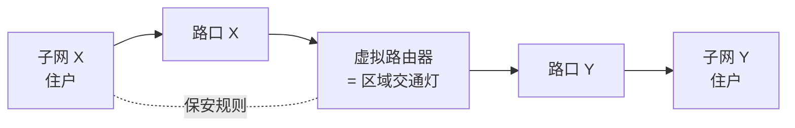
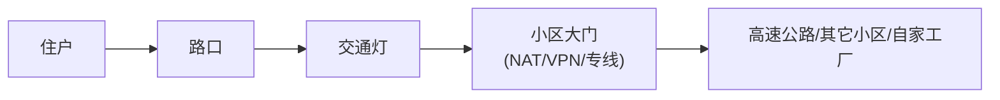
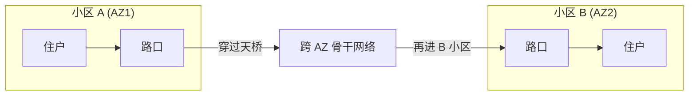
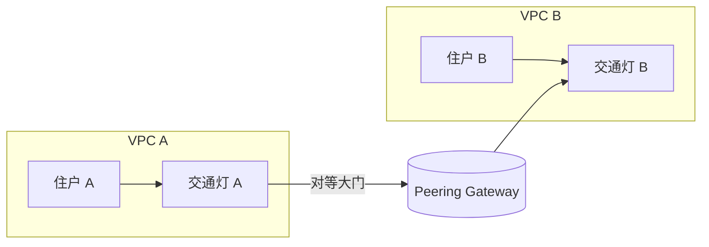
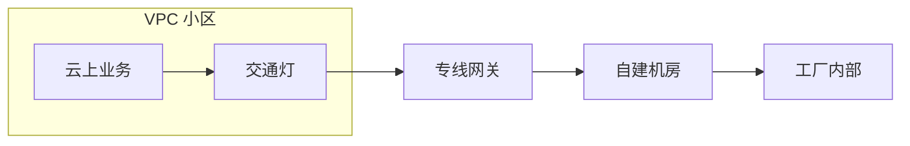
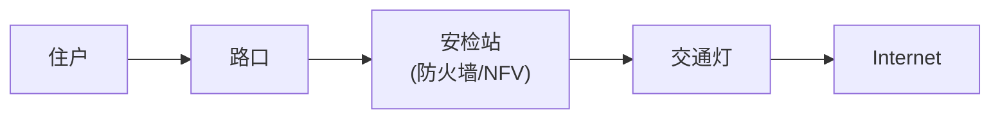
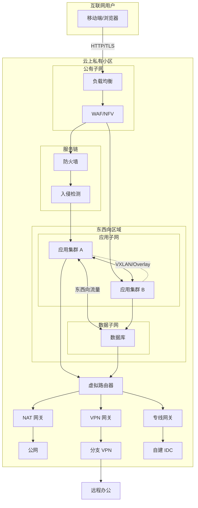

# 用最简单的话聊聊 VPC（What / Why / How）

把云想成一座超级大的城市。每个用户都可以在城里划出一块属于自己的小区，围上篱笆，还能自己规划街道、门禁和保安——这块小区就是 **VPC (Virtual Private Cloud)**。按照“费曼学习法”+ “What / Why / How”的顺序来解释：用最朴素的比喻搞懂每一种场景是什么、为什么出现、又是怎么实现的。

## 先记住三件事
1. **VPC 是云上的私家小区**：你决定有哪些道路（子网）、房子（虚机/容器）、保安规则（安全组/ACL）。
2. **虚拟交换机像路口，虚拟路由器像交通灯**：它们按你的“路况图”调度所有车（数据包）。
3. **出口设施（NAT/VPN/专线等）就是门禁**：车出入要经过登记、换牌照或者走特殊通道。

---

## 场景 1：同一个路口里两栋楼互聊（同子网、同宿主机）
**What：** 同一子网、同一宿主机的两台虚机互相通信。

**Why：** 大部分应用都会部署在同一物理节点或同一子网里，期望延迟最低、速度最快。

**How：**

- 两台虚机都挂在同一个虚拟交换机（电梯大厅），数据包在宿主机内直接完成转发，不需走外部网络。

---

## 场景 2：同一条街不同楼（同子网、跨宿主机）
**What：** 同一子网、但虚机在不同宿主机。

**Why：** 业务扩容或负载均衡需要把同一子网的实例放到不同物理机上。

**How：**

- 虚拟交换机 A 给数据包套上 VXLAN 等“封条”，通过物理网络送到宿主机 B，再由虚拟交换机 B 解封并转发，保证仍在同一子网内。

---

## 场景 3：不同街区（跨子网）
**What：** 两台虚机分属不同子网。

**Why：** 业务按功能/安全要求划分子网，需要严格的网络边界。

**How：**

- 先到虚拟路由器（交通灯）做三层转发，按路由表和安全组/ACL 控制流量，再进入目标子网的虚拟交换机。

---

## 场景 4：出小区上高速（公网/其它 VPC/混合云）
**What：** VPC 内实例访问公网、其他 VPC 或本地数据中心。

**Why：** 服务需要对外提供 API、访问第三方，或者与总部网络互联。

**How：**

- 经过虚拟路由器后进入出口网关（NAT/VPN/专线等）：
  - NAT 换公网“车牌”；
  - VPN 走加密通道；
  - 专线走私人高速。

---

## 场景 5：跨可用区 = 两个小区之间的天桥
**What：** 同一 VPC 的资源部署在不同可用区，仍需互通。

**Why：** 防止单个可用区故障导致服务中断，实现高可用。

**How：**

- 云厂商提供跨 AZ 的骨干网络/SDN；数据包在离开 AZ 时套上 VXLAN 等隧道封装，到另一 AZ 再解封，延迟比同 AZ 略高，但保证以租户 ID 隔离。

---

## 场景 6：两个小区互开后门（VPC 对等连接）
**What：** 两个 VPC 之间建立直接互访。

**Why：** 多租户/多项目隔离部署，但某些服务需要互通，例如共享数据库、中心化认证等。

**How：**

- 双方在控制面互相导入路由，把对方子网加入路由表，同时仍按各自安全组/ACL 控制。数据面通常走云厂商的骨干，无需经过公网。

---

## 场景 7：云上小区连到老家的工厂（专线/混合云）
**What：** 云上 VPC 与线下 IDC/办公室互联。

**Why：** 企业常有本地系统，需要与云上服务共享数据或做灾备。

**How：**

- 配置专线网关或 VPN 网关，通过 BGP/静态路由把云上、云下网段互相告知。数据走专线/隧道，或经 MPLS、SD-WAN 等接入网络。

---

## 场景 8：所有车出门必须经过安检（安全服务链）
**What：** 在流量路径上串接防火墙、入侵检测、负载均衡等 NFV 组件。

**Why：** 遵循合规/安全要求，确保南北向和东西向流量都被检查。

**How：**

- 控制面下发“服务链”规则，数据面强制流量按照顺序经过这些虚拟安全设备，可基于 SDN 或 Service Chaining 技术实现。

---

## 常见名词小抄
- **VPC**：云里的私家小区。
- **子网**：小区内的街区，划分住户。
- **虚拟交换机 (vSwitch)**：楼内或街区的路口，负责二层转发。
- **虚拟路由器 (vRouter)**：跨街区、进出小区的交通灯。
- **隧道 / VXLAN**：给车套上的封条，保证不同小区的车互不干扰。
- **骨干网络 / SDN**：连接所有小区的高速道路，由云厂商集中调度。
- **ToR / Leaf**：把每栋楼接入骨干的交换机。
- **安全组 / ACL**：保安名单。
- **NAT**：换车牌（私有地址转公网）。
- **VPN / 专线**：加密或独享的通行道路。
- **对等连接 (Peering)**：两个小区互开后门共享资源。
- **NFV / 服务链**：把虚拟防火墙、入侵检测等串在路上做安检。

> **总结**：每个场景都回答了“是什么”“为什么需要”“如何实现”。先理解这些“家常比喻”，再去看具体云厂商的参数/命令，就能很快入门 VPC 设计。

---

## 综合示例：一张图看懂 VPC 南北 / 东西流量 + 专线 + VPN + 隧道
**What：** 一个典型的企业级 VPC，既要对外提供服务（南北向），又要东西向分层部署，还要和自建机房、远程办公点互联。

**Why：**
- 对外业务需要通过 NAT/VPN 接入公网，满足客户访问（南北向）。
- 内部微服务/数据库之间有大量东西向通信，需要分层安全策略。
- 公司总部 / 分支机构 / 生产 IDC 要和云上互通，依赖专线与 VPN。

**How（示意图）：**

- **南北向流量**：Client → 负载均衡 → WAF → 服务链 → 应用，再经 NAT/出口访问公网或被公网访问。
- **东西向流量**：应用子网之间、应用与数据库之间通过 VXLAN/虚拟交换机互通，并由服务链策略检查。
- **VPN**：VPN 网关为远程办公或分支机构提供加密通道。
- **专线**：DirectGW 通过物理专线或 MPLS 连接 IDC，常上线 BGP 以实现动态路由。
- **隧道**：VPC 内部使用 VXLAN/隧道隔离不同子网，也可能在跨 AZ、专线、VPN 中叠加隧道封装。

通过这张图可以把前面各个场景串起来：VPC 就像一座有完善门禁、道路和跨城高速的小区，南北向、东西向、专线、VPN、NFV 安检都能在同一架构里组合使用。