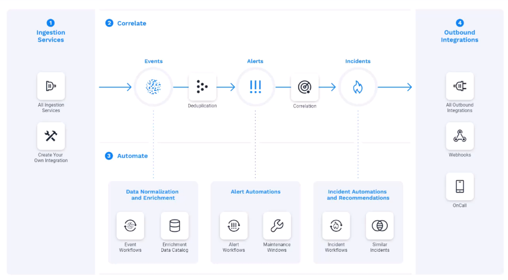

## APEX AIOPS 

### 事件管理流程

1、采集数据

- 通过各种外部系统收集数据，Tracing、Logging、Metrics等

2、关联告警

- 丰富事件数据，事件去重，将事件关联为告警（告警收敛？）

3、自动化其他互动

- 告警归属，等级、状态调整等（类似alarm-center插件）
- 设置维护时间段；（类似于告警屏蔽和hci的维护模式）
- 类似事件计算
  - 根据定义一些告警的“相似性的key”，再通过  Jaccard 指数计算， 确定事件的相似性，算法很复杂，不好应用；
  - 相似事件的解决方案
  - 聚类告警为事件

4、出站集成数据

- 发往第三方系统（webhook、jms、sre等）
- 值班（通知）

### 事件管理的用户工作流程：

### 特性

1. 降噪
   - 去除重复事件
2. 关联
   - 告警相似性算法和规则（https://docs.moogsoft.com/moogsoft-cloud/en/algorithms-vs-rules.html）
   - 聚合窗口（https://docs.moogsoft.com/moogsoft-cloud/en/explainer-video--alert-correlation---how-it-works.html）
3. 异常检测
   - 自适应检测器（动态阈值）
   - 阈值检测器（固定阈值）
4. 根因分析
5. 自动化
   - 工作流引擎
   - 自动修复
6. 集成
   - 通一个系统上就能查看到所有的信息，日志、指标、链路追踪

从上述分析来看，基本的功能我们scc也都具备，但是在每个垂直领域上，与moogsoft差距较大；

## 可以借鉴的地方

1、动态阈值

2、工作流引擎

### 工作流引擎

实践（https://docs.moogsoft.com/moogsoft-cloud/en/add-external-data-to-events--.html）

场景：

- 使用警报工作流引擎升级警报。例如，响应磁盘空间警报
- 使用事件工作流引擎来阻止它们处理。
- 使用外部数据（例如主机支持的服务或其位置）丰富警报。
- 使用警报工作流引擎来检测可预测来源的缺失事件，例如缺少保持活动事件。
- 控制有状态工作负载。例如，您可以配置一个工作流，使其保持“链接断开”事件，直到Moogsoft Enterprise在规定时间范围内收到相应的“链接建立”事件。
- 使用情况工作流引擎与外部系统集成，用于票务、通知、自动化和报告。
- 使用无事件工作流更改系统，无需创建事件、警报或情况。

工作流程：

- 新的事件到达工作流引擎，从而触发工作流。

- 每个工作流都有一个初始[触发器](https://docs.moogsoft.com/moogsoft-cloud/en/workflow-trigger.html)，它是一个事件过滤器，指定工作流将处理的事件。

  - 如果事件未通过触发过滤器，则工作流退出。
  - 如果工作流通过过滤器，则工作流将继续进行下一步。

- 事件经过一系列的[操作](https://docs.moogsoft.com/moogsoft-cloud/en/workflow-reference.html)来增强和更新事件中的数据。

  工作流可以使用来自外部[目录](https://docs.moogsoft.com/moogsoft-cloud/en/create-data-catalogs.html)的数据来[丰富](https://docs.moogsoft.com/moogsoft-cloud/en/query-catalog-action.html)事件。您还可以创建工作流，根据同一事件中的其他字段[来更新](https://docs.moogsoft.com/moogsoft-cloud/en/match-and-update-action.html)[事件](https://docs.moogsoft.com/moogsoft-cloud/en/parse-fqdn-action.html)[中的](https://docs.moogsoft.com/moogsoft-cloud/en/extract-substring-action.html)[字段](https://docs.moogsoft.com/moogsoft-cloud/en/split-action.html)[。](https://docs.moogsoft.com/moogsoft-cloud/en/template-field-action.html)

- 一旦事件通过所有相关工作流中的所有[操作](https://docs.moogsoft.com/moogsoft-cloud/en/workflow-reference.html)，数据管道就会执行以下操作：

  1. 将事件[重复数据删除并生成警报。](https://docs.moogsoft.com/moogsoft-cloud/en/deduplicate-events-to-reduce-noise.html)
  2. 将警报发送至[关联引擎](https://docs.moogsoft.com/moogsoft-cloud/en/correlate-alerts-into-incidents.html)。

可参考点：

alarm-center目前是通过插件来实现的上述类似的功能，例如告警去重、cmdb丰富、通知、升降级、屏蔽、特殊场景处理（描述修改、阈值调整等等）；我们每次在客户反馈后，需要走完整的流程，提需求、编写代码、测试、上库、发布；

