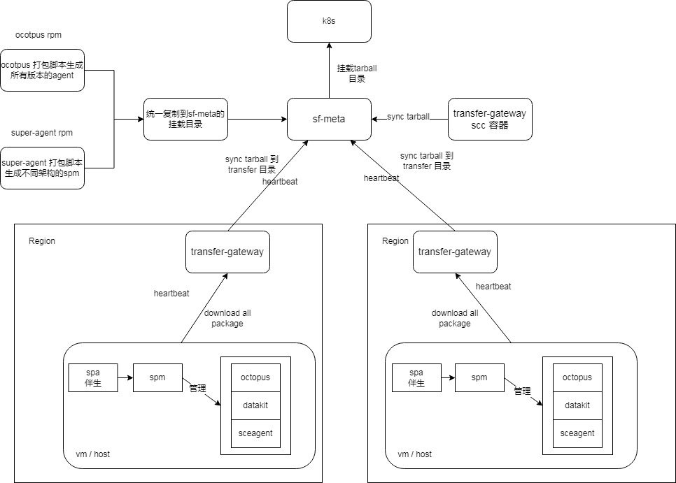
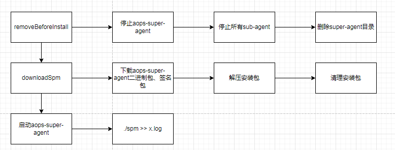
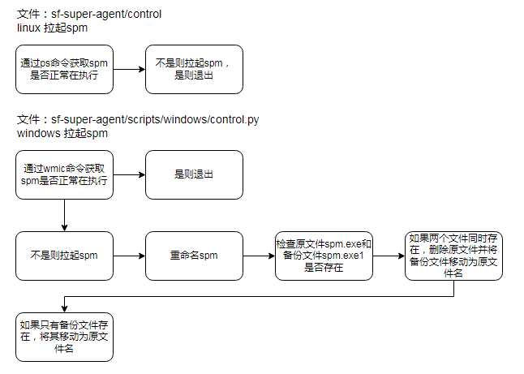
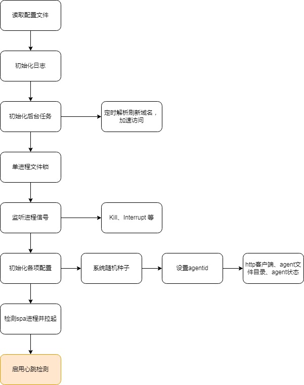
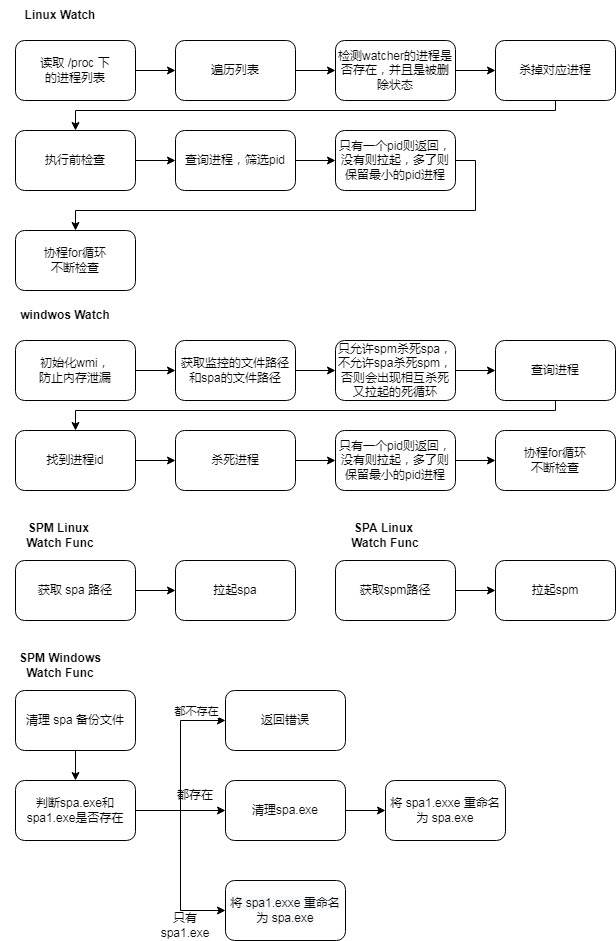
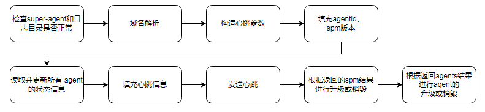
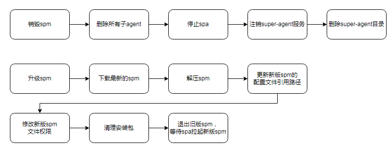
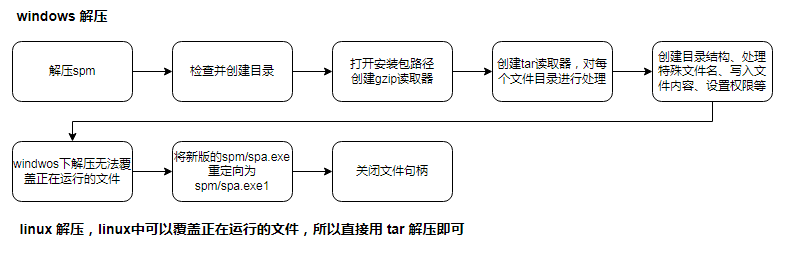

## agent 管理

### 架构图



### 项目整体架构

该项目是一个基于Go语言开发的超级代理系统，主要包含以下核心组件：

#### 核心组件

- SPM (Super Agent Manager): 超级代理管理器，负责管理子agent的生命周期
- SPA (Super Agent): 超级代理，负责监控SPM进程并在异常时重启
- aops-agent-service: 服务管理程序，负责整个系统的安装、卸载、启动、停止等操作

#### 外部组件

- sf-meta：接收aops-spm上报的心跳信息，并且将最新版本的aops-spm版本号以及各类agent版本号返回给aops-spm； 并且提供aops-spm和各类agent的安装包下载功能；
- transfer-gateway：转发代理，负责同步sf-meta上的安装包，并对外提供包下载服务能力；每个数据中心都会部署一个独立的转发代理服务，承接分流下载、心跳上报等功能；

项目架构特点：

1. 双进程设计：spm(管理核心) + spa(监控和拉起)
2. 跨平台支持：提供Windows和Linux的不同实现
3. 模块化设计：配置、日志、监控等功能分离
4. 心跳机制：定期上报状态
5. 子agent管理：支持子agent的生命周期管理

#### 目录结构

项目目录结构及功能分析：

1. 根目录文件：
   - Makefile: docker 构建脚本
   - go.mod/go.sum: Go模块依赖管理
   - control：linux控制脚本
     - 启动、停止 spm
2. config/:
   - config.go: 配置管理模块，定义配置结构体和解析逻辑
   - 功能：管理全局配置，包括日志、系统参数、spa监控等
3. doc/:
   - 存放项目文档和示意图
   - agent管理.png: 架构图
   - 子agent配置说明.png: 子agent配置说明图
4. etc/:
   - conf.yml: 默认配置文件
   - 功能：存放系统默认配置
5. scripts/: 提供跨平台的脚本支持
   - pkgs.sh: 核心打包脚本
     - 签名、打包spm/spa的不同架构版本
     - 编译 spm、spa、aops-agent-service
   - windows/: 
     - control.py: Windows控制脚本
       - 启动、停止 spm
   - service/: 服务管理程序，主要用来下载super-agent安装包并注册服务
  - 安装、启动、停止、重启、卸载
6. spa/:
   - main.go: 伴生进程主程序
   - 功能：监控spm进程状态并在其挂掉时自动拉起
7. spm/:
   - main.go: 核心管理进程主程序
   - agentid/: agent标识管理
   - system/: 系统管理
   - timer/: 定时任务管理
     - destruct_*.go: 销毁逻辑(平台相关)
     - heartbeat.go: 心跳检测
     - watcher_*.go: 进程监控(平台相关)
   - 功能：提供子agent的安装、升级、卸载、状态管理等核心功能
8. pkg/:
   - control/:
     - control.go: 子agent生命周期管理模块
     - 功能：提供子agent的安装、卸载、启动、停止、重启等操作
     - 支持获取子agent状态、版本、PID等信息
     - 支持批量停止所有子agent
   - file/: 公共的文件操作函数
   - sys/:
     - cmdline_linux.go: linux平台系统功能
     - cmdline_windows.go: Windows平台系统功能
     - 功能：不同平台的相同功能的差异实现
     - 包括：tar.gz解压、进程命令行获取等


### Agent管理机制

#### 管理层次结构

aops-agent-service (系统管理服务层)
 ↓
aops-spa (监控层) 
 ↓  ↑

aops-spm (管理层)
 ↓
sub-agents (子代理层)

#### 生命周期管理

**安装 (Install)**

aops-agent-service --control=install --agentId=xxx --endpoint=https://xxx:8888

安装流程：

1. 停止并清理旧版本
2. 从服务器下载指定版本的agent包
3. 验证签名并解压到目标目录
4. 生成agentId文件
5. 更新配置文件
6. 注册系统服务（非HCI/SCP环境）
7. 启动服务



**启动 (Start)**

- 服务启动：通过系统服务管理器启动，先拉起SPM，SPM再拉起SPA
- 脚本启动：HCI环境下直接通过脚本启动
- 监控机制：SPA监控SPM进程，异常时自动重启

windows/linux 拉起spm逻辑：

- windwos 会有特殊处理，通过重命名的方式来规避windwos下不允许直接替换文件的问题，备份文件则是解压安装包的时候处理的



spm main.go启动逻辑



**停止 (Stop)**

- 停止系统服务
- 强制终止SPM和SPA进程
- 停止所有子agent进程

**卸载 (Uninstall)**

- 停止所有相关进程
- 卸载系统服务
- 删除所有相关文件和目录

#### 不同架构的管理差异

Linux平台

- 使用bash脚本 control 进行管理
- 支持systemd服务管理
- 使用进程信号进行控制

Windows平台

- 使用Python脚本 control.py 进行管理，py文件会被 rem 编译为 exe 文件
- 通过Windows服务管理器注册服务
- 使用WMI和taskkill进行进程管理
- 支持文件重命名机制处理文件占用问题

### SPA和SPM的管理机制

#### SPA (Super Agent)

职责：

- 监控SPM进程状态
- SPM异常时自动重启
- 自身健康检查（内存、文件完整性）

关键特性：

- 单进程文件锁防止重复启动
- 定时检查基础目录和日志目录完整性
- 内存使用监控，超限自动退出

#### SPM (Super Agent Manager)

职责：

- 与服务器进行心跳通信
- 管理子agent的安装、升级、卸载
- 处理服务器下发的管理指令

核心功能：

- 心跳机制：定期向服务器报告状态并接收指令
- 子agent管理：根据服务器配置动态管理子agent
- 自升级：支持自身版本升级
- 环境变量管理：为子agent传递必要的环境变量

#### 伴生机制

SPA 是 SPM 的伴生进程，两者相互监督，检测到异常就相互拉起

1、windows watch 为什么只允许spm杀死spa，而允许 spa 杀死 spm？

- 升级时，是由spm的心跳去拉取新版本的安装包，并解压，然后自动退出spm程序，等待spa拉起；spm启动后，会杀掉spa，升级场景下需要重启spa、替换exe文件。如果双方都能相互杀死、拉起，则会出现死循环的情况；

2、值得注意的是，spa的拉起逻辑（如何替换备份文件等）是在spm的watch中实现的；而spm的拉起逻辑，则是由control.py这个脚本实现的；两边的逻辑都是类似；不过貌似统一放在control.py中也是可以的



### 升级场景

#### SPM、SPA 自升级

触发条件：心跳响应中包含升级指令 (cmd: "upgrade")

升级流程：

- 下载新版本压缩包并验证签名
- 解压到当前目录覆盖旧文件
- 更新配置文件中的服务器地址
- 修改新文件的执行权限
- 退出当前进程，由服务自动拉起新版本



销毁&升级spm



解压



#### 子Agent升级

升级策略：

- 版本比较：比较本地和远程版本号
- 环境变量比较：检查环境变量是否变化
- 增量更新：只更新有变化的agent
- 批量管理：支持同时管理多个子agent

升级流程：

- 停止旧版本agent
- 下载并安装新版本
- 更新环境变量配置
- 启动新版本agent
- 验证运行状态

#### 容错机制

- 下载失败重试：支持文件下载重试机制
- 回滚保护：升级失败时保持原有版本运行
- 健康检查：升级后验证服务状态
- 日志记录：详细记录升级过程和错误信息

### 配置管理

配置文件结构

- 主配置：etc/conf.yml - 系统核心配置
- 动态配置：支持配置文件热更新
- 环境适配：根据不同产品环境（HCI/SCP）调整行为

关键配置项

- heartbeatSrv: 心跳服务器地址
- heartbeatInterval: 心跳间隔时间
- spmMaxMem/spaMaxMem: 内存限制
- downloadTimeout: 下载超时时间

### 监控机制

- 进程监控：SPA监控SPM，SPM监控子agent
- 内存监控：定期检查内存使用，超限自动退出
- 文件完整性检查：定期验证关键文件存在性

通过分层架构和心跳机制实现了高可用的agent管理系统，支持多平台部署和动态升级，具有良好的容错和监控能力

### 打包机制

#### 构建流程

项目使用RPM build，通过 SPEC 文件打包为 RPM

支持的架构平台：

- windows/386
- windows/amd64
- linux/386
- linux/amd64

构建命令：

rpm build xxx   # 执行完整的多架构打包

#### 打包过程详解

核心文件：

- sf-super-agent.spec
- pkg.sh

环境准备：使用Docker镜像 registry.me/acmp/golang-cross-builder

依赖安装：安装 github.com/akavel/rsrc 用于Windows资源文件处理

交叉编译：

- 为每个目标平台设置对应的编译器（GCC/MinGW）
- Windows平台添加manifest资源文件
- Linux 386使用静态编译以支持32位程序在64位平台运行

生成的文件：

- aops-spm: SPM主程序
- aops-spa: SPA监控程序
- aops-agent-service: 服务管理程序
- control: 控制脚本（Linux）或 control.exe（Windows）
- 配置文件和目录结构

打包输出：

- 生成 aops-spm-{VERSION}_{OS}_{ARCH}.tar.gz 压缩包
- 包含签名验证文件
- 为不同平台生成对应的服务程序

### agent 安装

#### 手动安装

托管云 agent 的手动安装命令可以拆分为两部分

```bash
curl -kf4 -m 30 -X GET https://{{transfer-gateway-endpoint}}:8888/api/download/aops-agent-service-linux-amd64 -H 'x-agent-id: 5402204854438' -o aops-agent-service-linux-amd64
&& chmod +x aops-agent-service-linux-amd64 && ./aops-agent-service-linux-amd64 --control install --version c57f6a1d --agentId 5402204854438 --endpoint https://10.134.88.95:8888
```

1、下载 “下载器 aops-agent-service-linux-amd64” 

```bash
curl -kf4 -m 30 -X GET https://{{transfer-gateway-endpoint}}:8888/api/download/aops-agent-service-linux-amd64 -H 'x-agent-id: 5402204854438' -o aops-agent-service-linux-amd64
```

到 transfer-gateway 下载对应 版本-架构 的 super-agent 安装包

2、给下载器执行权限、执行下载器的安装命令

```bash
&& chmod +x aops-agent-service-linux-amd64 && ./aops-agent-service-linux-amd64 --control install --version c57f6a1d --agentId 5402204854438 --endpoint https://10.134.88.95:8888
```

这个安装命令，就是通过调用 aops-agent-service（服务管理程序）来安装agent；


