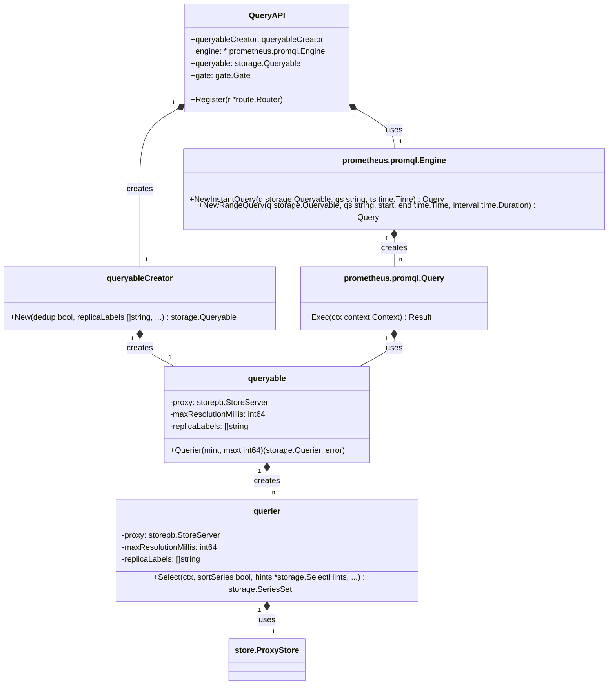

## 简介
thanos 是开源、高可用性的 Prometheus 设置，具有长期存储功能。

主要特性：
- 全局查询视图：通过在多个 Prometheus 服务器和集群中启用对 Prometheus 指标的查询来扩展 Prometheus 设置
- 使用选择的对象存储扩展系统，无限期地存储指标。支持 GCP、S3、Azure、Swift 和腾讯 COS
- 使用您喜欢的支持 Prometheus Query API 的相同工具，例如 Grafana 和其他工具
- 查询大时间范围或配置复杂的保留策略时，对历史数据进行下采样以加快大规模查询速度

## 部署形式

主要有两种部署形式：

### Sidecar
在每一个 Prometheus 节点旁边部署一个 thanos sidecar，将prometheus本地的tsdb数据同步到对象存储中；


### Receiver
提供一个统一的 receiver 接受所有来源的数据写入对象存储；


## 使用

``` go
// thanos compactor ui
http://10.134.89.110:10905
// thanos store ui
http://10.134.89.110:10904
// thanos query ui
http://10.134.89.110:9091
// Prometheus
http://10.134.89.110:9090
// minio 
http://10.134.89.110:9000
```

## 降采样

时序数据的降采样是指将频率较高的时序数据降低到较低频率的时序数据的过程。降采样可以减少数据量从而延长存储时间，提升查询速度，同时尽可能地保留原始数据的趋势和特征。日志服务的降采样通过将时间序列中的数据点进行特定算法的分组与聚合来实现。

注意：降采样本身并不会减少存储空间
### 降采样原理


### Compactor

thanos 的降采样核心逻辑在 pkg/compact/downsample，集成在 thanos compact 组件中；
这个压缩器既负责压缩、去重指标，也同时负责降采样；`thanos compact`命令将 Prometheus 2.0 存储引擎的压缩过程应用于对象存储中存储的块数据。


在以给定分辨率进行降采样之前，存在一个时间延迟。这是必要的，因为降采样后的块包含的样本较少，而且由于块的大小是固定的，因此需要跨越更长时间间隔的数据来填充它们。

- Creating 5m downsampling for blocks older than **40 hours** (2d)  
    为超过 **40 小时** （2 天）的区块创建 5 分钟下采样
- Creating 1h downsampling for blocks older than **10 days** (2w)  
    为超过 **10 天**的区块创建 1 小时下采样（2w）

### thanos 的具体实现

Thanos Compactor 采用“原始”分辨率块，并创建一个包含“降采样”块的新分辨率块。降采样块采用“AggrChunk”的存储级别形式：

``` go
message AggrChunk {
    int64 min_time = 1;
    int64 max_time = 2;

    Chunk raw     = 3;
    Chunk count   = 4;
    Chunk sum     = 5;
    Chunk min     = 6;
    Chunk max     = 7;
    Chunk counter = 8;
}
```

### 默认查询

当查询降采样后的aggrchunk时，promql中没有指定聚合函数，Thanos Querier 会默认请求 COUNT 和 SUM 聚合块，用来计算平均值；

``` go
// aggrsFromFunc infers aggregates of the underlying data based on the wrapping
// function of a series selection.
func aggrsFromFunc(f string) []storepb.Aggr {
	if f == "min" || strings.HasPrefix(f, "min_") {
		return []storepb.Aggr{storepb.Aggr_MIN}
	}
	if f == "max" || strings.HasPrefix(f, "max_") {
		return []storepb.Aggr{storepb.Aggr_MAX}
	}
	if f == "count" || strings.HasPrefix(f, "count_") {
		return []storepb.Aggr{storepb.Aggr_COUNT}
	}
	// f == "sum" falls through here since we want the actual samples.
	if strings.HasPrefix(f, "sum_") {
		return []storepb.Aggr{storepb.Aggr_SUM}
	}
	if f == "increase" || f == "rate" || f == "irate" || f == "resets" || f == "xincrease" || f == "xrate" {
		return []storepb.Aggr{storepb.Aggr_COUNTER}
	}
	// In the default case, we retrieve count and sum to compute an average.
	return []storepb.Aggr{storepb.Aggr_COUNT, storepb.Aggr_SUM}
}
```

### 当前窗口计算

``` go
// currentWindow returns the end timestamp of the window that t falls into.
func currentWindow(t, r int64) int64 {
	// The next timestamp is the next number after s.t that's aligned with window.
	// We subtract 1 because block ranges are [from, to) and the last sample would
	// go out of bounds otherwise.
	return t - (t % r) + r - 1
}
```

假设分辨率 r 为 5 分钟（300,000 毫秒），时间戳 t 为 1,620,000,001 毫秒：
- 计算 t % r 得到 1 毫秒
- 计算 t - (t % r) 得到 1,620,000,000 毫秒（当前窗口起始时间）
- 加上 r 得到 1,620,300,000 毫秒（下一个窗口起始时间）
- 减 1 得到 1,620,299,999 毫秒（当前窗口结束时间）
这确保了时间窗口  `[1,620,000,000, 1,620,300,000)` 内的所有样本都被正确包含在当前窗口中。

currentWindow 函数的设计是为了满足降采样过程中时间窗口对齐、区间表示适配、批次划分、防止重叠和支持聚合逻辑的需求。通过将时间戳准确对齐到窗口边界，并适配左闭右开的区间表示，确保了降采样数据的准确性和一致性。

### 数据聚合器

thanos 中只有两种聚合器，一个是浮点数、一个是直方图；这两种聚合器，就能够将所有的Prometheus 数据类型都覆盖到：
- 数值型数据 ：最常见的 float64 类型数据，用于表示大多数监控指标,例如：`guage、count`
- 直方图数据 ：用于表示数据分布情况的复杂类型，对性能分析和 SLO 监控至关重要；例如：`histogram、summary`

#### thanos simple metric

``` go
type sample struct {
	t  int64                    // 时间戳
	v  float64                  // 浮点数值（用于非直方图样本）
	fh *histogram.FloatHistogram // 浮点直方图（用于直方图样本）
}
```

#### 浮点数聚合器

``` go
// floatAggregator collects cumulative stats for a stream of values.
type floatAggregator struct {
	total   int     // Total samples processed.
	count   int     // Samples in current window.
	sum     float64 // Value sum of current window.
	min     float64 // Min of current window.
	max     float64 // Max of current window.
	counter float64 // Total counter state since beginning.
	resets  int     // Number of counter resets since beginning.
	last    float64 // Last added value.
}
```

关键变量说明
- a.total : 已处理的总样本数
- a.counter : 计数器值，用于累计计算
- a.resets : 计数器重置次数
- a.last : 上一个样本的值
- a.sum : 所有样本值的总和
- a.count : 当前聚合窗口内的样本数
- a.min / a.max : 样本中的最小值/最大值

``` go
// 核心方法
func (a *floatAggregator) add(s sample) {
	if a.total > 0 {
		if s.v < a.last {
			// Counter reset, correct the value.
			a.counter += s.v
			a.resets++
		} else {
			// Add delta with last value to the counter.
			a.counter += s.v - a.last
		}
	} else {
		// First sample sets the counter.
		a.counter = s.v
	}
	a.last = s.v

	a.sum += s.v
	a.count++
	a.total++

	if s.v < a.min {
		a.min = s.v
	}
	if s.v > a.max {
		a.max = s.v
	}
}
```

该方法接收一个样本点 s ，并根据样本值和历史状态更新聚合器的内部状态，包括计数器值、总和、计数、最大值、最小值等。
设计理念：
1. 计数器重置检测 : 该方法能够自动检测计数器重置事件(如服务重启导致的计数器归零)，并通过 resets 字段记录，确保聚合结果的准确性
2. 增量计算 : 对于正常增长的计数器，通过计算增量( s.v - a.last )而非直接累加，避免重复计数
3. 多维度统计 : 同时维护总和、计数、最大/最小值等多种统计指标，为降采样提供全面的数据支持
4. 状态维护 : 通过维护 last 和 total 等状态变量，确保跨批次样本处理的连续性

#### 直方图聚合器

``` go
type histogramAggregator struct {
	total    int                       // 总共处理的直方图数量
	count    int                       // 当前窗口中的直方图数量
	sum      *histogram.FloatHistogram // 当前窗口的值总和（用于仪表直方图）
	counter  *histogram.FloatHistogram // 自开始以来的总计数器状态（用于计数器直方图）
	previous *histogram.FloatHistogram // 上一个添加的值
	schema   int32                     // 正在聚合的批次中的最小模式
}


```

该方法用于将直方图样本添加到聚合器中进行聚合计算

``` go
func (h *histogramAggregator) add(s sample) {
	fh := s.fh
	// 低分变率无法聚合为高分辨率的指标
	if fh.Schema < h.schema {
		panic("schema must be greater or equal to aggregator schema")
	}

	// A schema increase is treated as a reset, so we need to preserve
	// the original histogram in case the schema is adjusted.
	oFh := fh
	// If schema of the sample is greater than the
	// aggregator schema, we need to reduce the resolution.
	if fh.Schema > h.schema {
		// 通过降分辨率来统一所有样本的精度，确保聚合的一致性
		fh = fh.CopyToSchema(h.schema)
	}

	if h.total > 0 {
		if fh.CounterResetHint != histogram.GaugeType && oFh.DetectReset(h.previous) {
			// Counter reset, correct the value.
			mustHistogramOp(h.counter.Add(fh))
		} else {
			// Add delta with previous value to the counter.
			// 直方图差值计算
			deltaFh, err := fh.Copy().Sub(h.previous)
			if err != nil {
				// TODO(GiedriusS): support native histograms with custom buckets.
				// This can only happen with custom buckets.
				panic(fmt.Sprintf("unexpected error: %v", err))
			}
			// 直方图counter累加
			mustHistogramOp(h.counter.Add(deltaFh))
		}
	} else {
		// First sample sets the counter.
		h.counter = fh.Copy()
	}

	// 直方图求和
	if h.sum == nil {
		h.sum = fh.Copy()
	} else {
		mustHistogramOp(h.sum.Add(fh))
	}

	// This needs to be h gauge histogram, otherwise reset detection will be triggered
	// when appending the aggregated chunk and histogram.count < appender.count.
	h.sum.CounterResetHint = histogram.GaugeType

	h.previous = fh

	h.count++
	h.total++
}
```

设计理念：
1. Schema统一 ：使用 CopyToSchema 确保所有直方图使用相同的分辨率
2. Counter处理 ：
	- 检测counter reset： oFh.DetectReset(h.previous)
	- 如果有reset：直接 h.counter.Add(fh)
	- 如果无reset：计算增量 fh.Copy().Sub(h.previous) 然后累加
3. Sum处理 ：
	- 使用 h.sum.Add(fh) 累加当前窗口的直方图值
4. 状态更新 ：
	- 更新 h.previous 、 h.count 、 h.total 等状态

这种设计确保了直方图数据在降采样过程中既保持了counter的语义（处理reset和增量），又支持gauge的语义（窗口期求和），同时通过schema统一保证了数据的一致性。


## 总结

### thanos 的降采样思路

- 定时（每2h）扫描存储桶中的bucket，然后将延迟一定时长（例如：40h、10d）的 blocks 块进行不同分辨率（5m、1h）的降采样。降采样后的数据也存储在同一个存储桶（会增加存储压力）

核心算法：
- 每个窗口（windows）分辨率，会保留所有指标的特征值（最大值、最小值、总值、总数等）
- 不同的数据类型有不同的计算规则，但总体思路是一致的

查询适配：
- 在查询引擎中会根据查询语句传入的参数，选择不同的存储引擎，或者不同的分辨率（raw、5m、1h、auto）
- promql 函数适配，因为经过采样，已经保留了指标的特征值，所以很多promql中的功能函数（sum、count、max、min等）都能直接取值，不需要经过计算；当promql中没有传入功能函数时，则会按照平均值进行计算；
- 在查询满足时间范围内的blocks时，会查询出所有分辨率的blocks块，根据传入的分辨率参数，优先查询尽可能大的分辨率，如果当前分辨率无法覆盖所有数据，则使用更高分辨率的块填充

局限性：

> - 依赖 Prometheus v2.2.1 以上
> - 只有配置了对象存储，才能使用 thanos compact 能力；compact 和 downsample 都是基于对象存储的
> - 不具备并发安全性，并且必须针对存储桶部署为单例
> - 需要为Prometheus配置全局的外部标签，区分不同实例的指标，这样压缩器才能正常工作；

### 可行性分析

 thanos 的降采样功能核心逻辑其实很简单，就是一个downsample 的go文件进行聚合操作；但是实际上要将采样后的指标数据，进行可拓展查询、存储，则依赖 thanos 复杂的查询引擎、存储引擎；所以，如果想要在 vm 上借鉴这个降采样的思路，就需要接受较大的改动；


可预见的改动点：
- 存储结构需要支持聚合后，保留了指标特征值的新数据结构
- 查询需要适配不同分辨率处理、整合
- 新增任务，扫描存储指标进行降采样

问题：
- 学习成本高，要支持一种新结构的CRUD，并且需要兼容老结构，首先就需要非常熟悉vm的代码，了解每一个细节，才能动手改造；
- 侵入性大，改完后续合入社区版本代码，大概率是冲突的

可能的解决思路？
- 新建一个仓库，专门负责扫描vm的数据进行降采样，然后按照降采样后的数据存储到另外一个地方；
- 对vm-select做适配，根据查询参数中的分辨率，查询不同的存储引擎，类似与 thanos，最后再整合数据即可

## 拓展

比较有意思的是 thanos 的查询引擎，可以查询出降采样或者raw的指标数据；简单来讲，就是 thanos 的 querier 实现了 prometheus 的 storage 的 Querier 接口方法， 来自定义自己的查询和组合数据返回的方式；
## 查询器整体架构概览

Thanos Query组件的核心职责是接收来自用户（如Grafana）的PromQL查询请求，将其分发到后端的多个Store节点（如Sidecar、Store Gateway、Ruler等），然后将返回的结果进行聚合、去重，最终返回给用户。

分层设计：


我们可以用一张UML类图来描绘核心组件之间的关系：



**图解核心关系**：

*   `QueryAPI` 是HTTP API的入口，它持有一个 `querierCreator`。
*   `querierCreator` 是一个工厂，负责创建 `queryable` 实例。`queryable` 是Prometheus `storage.Queryable` 接口的实现，代表了一个可查询的数据源。
*   当Prometheus查询引擎（`promql.Engine`）需要执行查询时，它会从 `queryable` 中获取一个 `querier` 实例。
*   `querier` 实现了 `storage.Querier` 接口，其核心方法是 `Select`，负责从后端的 `store.ProxyStore` 获取数据。

---

### 关键组件详解

现在我们来逐一分析您提到的关键组件。

#### 1. `queryapi` 结构体 (pkg/api/query/api.go)

这个结构体是Thanos Query的HTTP API层实现，负责接收和处理查询请求。

*   **`querierCreator`**: 这是一个函数类型，扮演着**工厂方法**的角色。它的职责是创建一个实现了 `storage.Queryable` 接口的对象。通过将创建逻辑封装在一个函数中，`QueryAPI` 无需关心 `Queryable` 的具体实现细节，实现了**依赖倒置**。每次HTTP请求进来时，`QueryAPI` 都会调用这个函数来创建一个新的 `Queryable` 实例，从而可以根据请求参数（如去重、副本标签等）定制查询行为。
*   **`engine`**: 这是Prometheus的查询引擎实例 (`*promql.Engine`)。`QueryAPI` 将 `Queryable` 和查询语句（PromQL）交给这个引擎来执行实际的解析、计算和求值。
*   **`gate`**: 这是一个并发控制器 (`gate.Gate`)，用于限制同时执行的查询数量，防止Thanos Query组件因过载而崩溃。这是一个典型的**限流器/守卫模式**的应用。
*   **`engineType`**: 这个字段在较新版本中可能已被移除或重构，但在早期版本中，它用于区分不同的查询引擎实现（例如，标准的Prometheus引擎或自定义的引擎）。

#### 2. `querierCreator` (pkg/query/querier.go)

这是一个函数签名，定义了一个工厂方法。

```go
type QueryableCreator func(
    deduplicate bool,
    replicaLabels []string,
    ...
) storage.Queryable
```

*   **作用**：它的核心作用是**解耦** `QueryAPI` 和 `queryable` 的具体实现。`QueryAPI` 只依赖于这个函数签名，而不关心它背后是如何创建 `queryable` 的。
*   **设计模式：工厂方法 (Factory Method)**：`querierCreator` 本身就是一个工厂方法。它推迟了 `queryable` 实例的创建过程，允许在运行时根据不同的参数（如是否去重）来创建不同配置的 `queryable` 对象。
*   **返回 `storage.Queryable`**：它返回的是一个接口，而不是一个具体的结构体。这使得Thanos可以灵活地替换 `queryable` 的实现，只要新的实现满足 `storage.Queryable` 接口即可。

#### 3. `queryCreator` 接口 (这个接口在当前版本中可能已经演化)

在Thanos的演进过程中，`queryCreator` 的概念可能已经被重构到 `promql.Engine` 的 `NewInstantQuery` 和 `NewRangeQuery` 方法中。在Prometheus的体系中，`promql.Engine` 扮演了查询创建者的角色。它提供了两个核心方法：

*   `NewInstantQuery(...) promql.Query`: 创建一个瞬时查询。
*   `NewRangeQuery(...) promql.Query`: 创建一个范围查询。

这两个方法接收一个 `storage.Queryable` 作为数据源，以及PromQL查询字符串和时间参数，然后返回一个实现了 `promql.Query` 接口的对象。

#### 4. `queryFactory` 和 `compatibilityQuery`

这里的 `queryFactory` 概念与 `promql.Engine` 的作用重合。`promql.Engine` 就是一个查询工厂。它创建的 `promql.Query` 对象（在内部可以看作是 `compatibilityQuery` 的概念）是一个**命令对象 (Command Pattern)**。这个对象封装了执行一个查询所需要的所有信息（查询语句、时间范围、数据源等）。

#### 5. `compatibilityQuery.Exec` 方法

当您调用 `promql.Query` 的 `Exec` 方法时，就触发了查询的执行。这是一个典型的**命令模式**的体现。

**执行流程**：

1.  **进入 `Exec`**：调用 `query.Exec(ctx)`。
2.  **获取 Querier**：`Exec` 方法首先会调用其持有的 `storage.Queryable` 实例的 `Querier(mint, maxt)` 方法，获取一个针对特定时间范围的 `storage.Querier` 实例。
3.  **创建分析器**：Prometheus引擎会创建一个 `promql.analysis` 对象，用于分析查询语句，并确定需要从存储中选择哪些Series。
4.  **执行选择**：在查询计划的执行过程中，当遇到一个向量选择器（如 `my_metric{label="value"}`）时，引擎会调用 `querier.Select(...)` 方法。
5.  **`querier.Select`**：这是Thanos的核心逻辑所在。`querier` 的 `Select` 方法会将请求参数（时间范围、标签匹配器、函数提示等）打包成一个 `storepb.SeriesRequest`。
6.  **Proxy Store 调用**：`querier` 通过其内部的 `store.ProxyStore`，将这个请求**扇出 (Fan-out)** 到所有已知的后端Store节点。
7.  **数据返回与聚合**：`ProxyStore` 收集所有Store节点的响应，进行排序、去重（如果开启），然后将结果以 `storage.SeriesSet` 的形式返回给Prometheus引擎。
8.  **引擎计算**：Prometheus引擎拿到数据后，继续执行后续的计算（如 `rate`, `sum` 等），最终生成 `promql.Result`。

#### 6. `query.exec` -> `vectorSelector` -> `loadSeries` -> `queryable.Select`

这是对 `Exec` 流程更底层的细化，完全正确。

*   `query.exec` 是Prometheus引擎内部的执行体。
*   当它解析到 `vectorSelector`（向量选择器）时，它知道需要去加载时序数据了。
*   它会调用一个类似 `loadSeries` 的内部函数，这个函数的核心就是调用 `querier.Select()`。
*   `querier.Select()` 正如我们上面分析的，是Thanos与后端存储交互的桥梁。它会利用 `aggrsFromFunc` 和 `maxResolutionFromSelectHints` 等辅助函数来优化对StoreAPI的请求，尽可能地利用降采样数据。

### 设计模式总结

Thanos Query组件是一个设计模式应用的典范：

*   **工厂方法 (Factory Method)**：`querierCreator` 用于创建 `queryable` 对象，实现了创建过程的解耦。
*   **策略模式 (Strategy Pattern)**：通过 `aggrsFromFunc` 和 `maxResolutionFromSelectHints`，Thanos可以根据查询的不同（不同的函数、`step`等）采取不同的数据获取策略（请求原始数据、请求特定聚合数据、请求特定分辨率的数据）。
*   **命令模式 (Command Pattern)**：`promql.Query` 对象封装了查询的所有信息，`Exec` 方法就是执行这个命令。
*   **适配器模式 (Adapter Pattern)**：`queryable` 和 `querier` 结构体可以看作是适配器，它们将Thanos后端的 `store.ProxyStore` 适配给Prometheus查询引擎所期望的 `storage.Queryable` 和 `storage.Querier` 接口。
*   **代理模式 (Proxy Pattern)**：`store.ProxyStore` 本身就是一个代理，它代理了对多个后端Store节点的访问。
*   **外观模式 (Facade Pattern)**：`QueryAPI` 为上层调用者提供了一个简化的接口，隐藏了内部复杂的查询创建、执行、扇出、聚合的逻辑。
*   **依赖倒置原则 (Dependency Inversion Principle)**：高层模块（如 `QueryAPI`）不依赖于低层模块（如 `queryable` 的具体实现），而是依赖于抽象（`querierCreator` 函数和 `storage.Queryable` 接口）。
