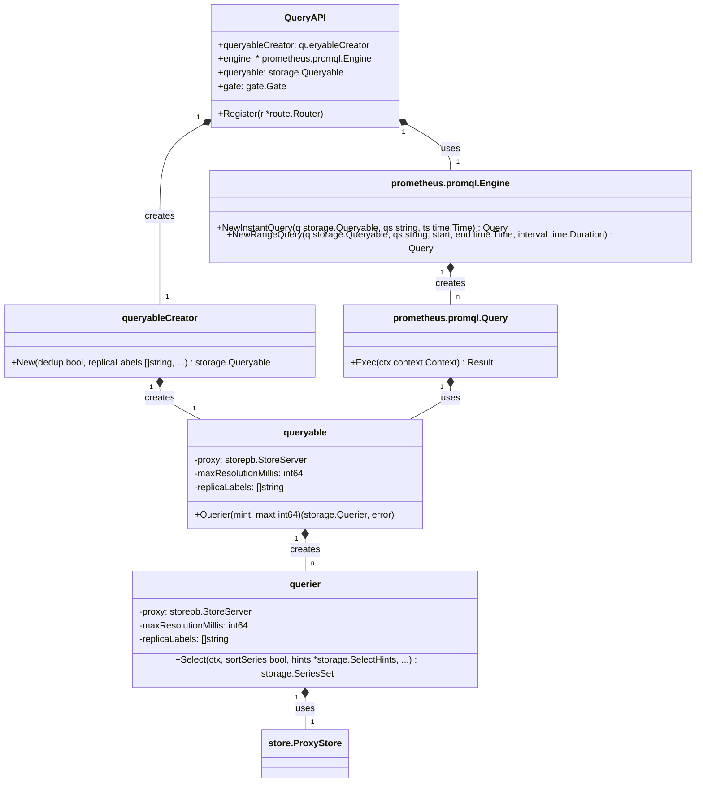

### 整体架构概览

Thanos Query组件的核心职责是接收来自用户（如Grafana）的PromQL查询请求，将其分发到后端的多个Store节点（如Sidecar、Store Gateway、Ruler等），然后将返回的结果进行聚合、去重，最终返回给用户。


为了更好地理解其内部结构，我们可以用一张UML类图来描绘核心组件之间的关系：



**图解核心关系**：

*   `QueryAPI` 是HTTP API的入口，它持有一个 `querierCreator`。
*   `querierCreator` 是一个工厂，负责创建 `queryable` 实例。`queryable` 是Prometheus `storage.Queryable` 接口的实现，代表了一个可查询的数据源。
*   当Prometheus查询引擎（`promql.Engine`）需要执行查询时，它会从 `queryable` 中获取一个 `querier` 实例。
*   `querier` 实现了 `storage.Querier` 接口，其核心方法是 `Select`，负责从后端的 `store.ProxyStore` 获取数据。

---

### 关键组件详解

现在我们来逐一分析您提到的关键组件。

#### 1. `queryapi` 结构体 (pkg/api/query/api.go)

这个结构体是Thanos Query的HTTP API层实现，负责接收和处理查询请求。

*   **`querierCreator`**: 这是一个函数类型，扮演着**工厂方法**的角色。它的职责是创建一个实现了 `storage.Queryable` 接口的对象。通过将创建逻辑封装在一个函数中，`QueryAPI` 无需关心 `Queryable` 的具体实现细节，实现了**依赖倒置**。每次HTTP请求进来时，`QueryAPI` 都会调用这个函数来创建一个新的 `Queryable` 实例，从而可以根据请求参数（如去重、副本标签等）定制查询行为。
*   **`engine`**: 这是Prometheus的查询引擎实例 (`*promql.Engine`)。`QueryAPI` 将 `Queryable` 和查询语句（PromQL）交给这个引擎来执行实际的解析、计算和求值。
*   **`gate`**: 这是一个并发控制器 (`gate.Gate`)，用于限制同时执行的查询数量，防止Thanos Query组件因过载而崩溃。这是一个典型的**限流器/守卫模式**的应用。
*   **`engineType`**: 这个字段在较新版本中可能已被移除或重构，但在早期版本中，它用于区分不同的查询引擎实现（例如，标准的Prometheus引擎或自定义的引擎）。

#### 2. `querierCreator` (pkg/query/querier.go)

这是一个函数签名，定义了一个工厂方法。

```go
type QueryableCreator func(
    deduplicate bool,
    replicaLabels []string,
    ...
) storage.Queryable
```

*   **作用**：它的核心作用是**解耦** `QueryAPI` 和 `queryable` 的具体实现。`QueryAPI` 只依赖于这个函数签名，而不关心它背后是如何创建 `queryable` 的。
*   **设计模式：工厂方法 (Factory Method)**：`querierCreator` 本身就是一个工厂方法。它推迟了 `queryable` 实例的创建过程，允许在运行时根据不同的参数（如是否去重）来创建不同配置的 `queryable` 对象。
*   **返回 `storage.Queryable`**：它返回的是一个接口，而不是一个具体的结构体。这使得Thanos可以灵活地替换 `queryable` 的实现，只要新的实现满足 `storage.Queryable` 接口即可。

#### 3. `queryCreator` 接口 (这个接口在当前版本中可能已经演化)

在Thanos的演进过程中，`queryCreator` 的概念可能已经被重构到 `promql.Engine` 的 `NewInstantQuery` 和 `NewRangeQuery` 方法中。在Prometheus的体系中，`promql.Engine` 扮演了查询创建者的角色。它提供了两个核心方法：

*   `NewInstantQuery(...) promql.Query`: 创建一个瞬时查询。
*   `NewRangeQuery(...) promql.Query`: 创建一个范围查询。

这两个方法接收一个 `storage.Queryable` 作为数据源，以及PromQL查询字符串和时间参数，然后返回一个实现了 `promql.Query` 接口的对象。

#### 4. `queryFactory` 和 `compatibilityQuery`

这里的 `queryFactory` 概念与 `promql.Engine` 的作用重合。`promql.Engine` 就是一个查询工厂。它创建的 `promql.Query` 对象（在内部可以看作是 `compatibilityQuery` 的概念）是一个**命令对象 (Command Pattern)**。这个对象封装了执行一个查询所需要的所有信息（查询语句、时间范围、数据源等）。

#### 5. `compatibilityQuery.Exec` 方法

当您调用 `promql.Query` 的 `Exec` 方法时，就触发了查询的执行。这是一个典型的**命令模式**的体现。

**执行流程**：

1.  **进入 `Exec`**：调用 `query.Exec(ctx)`。
2.  **获取 Querier**：`Exec` 方法首先会调用其持有的 `storage.Queryable` 实例的 `Querier(mint, maxt)` 方法，获取一个针对特定时间范围的 `storage.Querier` 实例。
3.  **创建分析器**：Prometheus引擎会创建一个 `promql.analysis` 对象，用于分析查询语句，并确定需要从存储中选择哪些Series。
4.  **执行选择**：在查询计划的执行过程中，当遇到一个向量选择器（如 `my_metric{label="value"}`）时，引擎会调用 `querier.Select(...)` 方法。
5.  **`querier.Select`**：这是Thanos的核心逻辑所在。`querier` 的 `Select` 方法会将请求参数（时间范围、标签匹配器、函数提示等）打包成一个 `storepb.SeriesRequest`。
6.  **Proxy Store 调用**：`querier` 通过其内部的 `store.ProxyStore`，将这个请求**扇出 (Fan-out)** 到所有已知的后端Store节点。
7.  **数据返回与聚合**：`ProxyStore` 收集所有Store节点的响应，进行排序、去重（如果开启），然后将结果以 `storage.SeriesSet` 的形式返回给Prometheus引擎。
8.  **引擎计算**：Prometheus引擎拿到数据后，继续执行后续的计算（如 `rate`, `sum` 等），最终生成 `promql.Result`。

#### 6. `query.exec` -> `vectorSelector` -> `loadSeries` -> `queryable.Select`

这是对 `Exec` 流程更底层的细化，完全正确。

*   `query.exec` 是Prometheus引擎内部的执行体。
*   当它解析到 `vectorSelector`（向量选择器）时，它知道需要去加载时序数据了。
*   它会调用一个类似 `loadSeries` 的内部函数，这个函数的核心就是调用 `querier.Select()`。
*   `querier.Select()` 正如我们上面分析的，是Thanos与后端存储交互的桥梁。它会利用 `aggrsFromFunc` 和 `maxResolutionFromSelectHints` 等辅助函数来优化对StoreAPI的请求，尽可能地利用降采样数据。

### 设计模式总结

Thanos Query组件是一个设计模式应用的典范：

*   **工厂方法 (Factory Method)**：`querierCreator` 用于创建 `queryable` 对象，实现了创建过程的解耦。
*   **策略模式 (Strategy Pattern)**：通过 `aggrsFromFunc` 和 `maxResolutionFromSelectHints`，Thanos可以根据查询的不同（不同的函数、`step`等）采取不同的数据获取策略（请求原始数据、请求特定聚合数据、请求特定分辨率的数据）。
*   **命令模式 (Command Pattern)**：`promql.Query` 对象封装了查询的所有信息，`Exec` 方法就是执行这个命令。
*   **适配器模式 (Adapter Pattern)**：`queryable` 和 `querier` 结构体可以看作是适配器，它们将Thanos后端的 `store.ProxyStore` 适配给Prometheus查询引擎所期望的 `storage.Queryable` 和 `storage.Querier` 接口。
*   **代理模式 (Proxy Pattern)**：`store.ProxyStore` 本身就是一个代理，它代理了对多个后端Store节点的访问。
*   **外观模式 (Facade Pattern)**：`QueryAPI` 为上层调用者提供了一个简化的接口，隐藏了内部复杂的查询创建、执行、扇出、聚合的逻辑。
*   **依赖倒置原则 (Dependency Inversion Principle)**：高层模块（如 `QueryAPI`）不依赖于低层模块（如 `queryable` 的具体实现），而是依赖于抽象（`querierCreator` 函数和 `storage.Queryable` 接口）。
