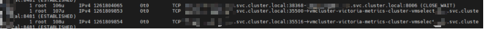
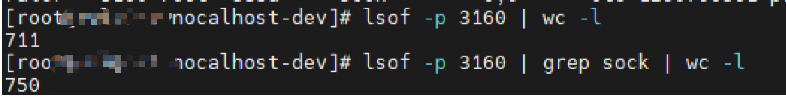
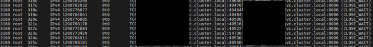
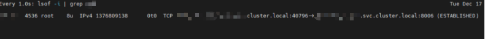
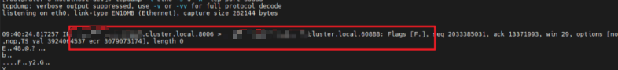
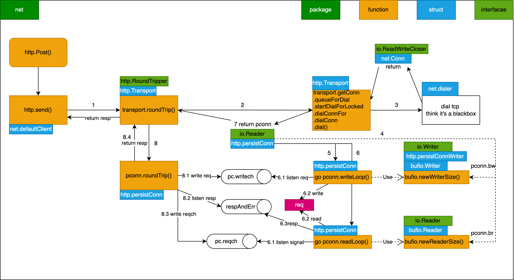
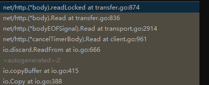

## Reference
- [关于 Golang 中 http.Response.Body 未读取导致连接复用问题的一点研究](https://blog.twofei.com/858/)
- https://manishrjain.com/must-close-golang-http-response
- https://www.reddit.com/r/golang/comments/13fphyz/til_go_response_body_must_be_closed_even_if_you/?rdt=35002
- https://medium.com/@nate510/don-t-use-go-s-default-http-client-4804cb19f779
- https://stackoverflow.com/questions/17948827/reusing-http-connections-in-go
- 内存泄漏排查：https://lessisbetter.site/2019/05/18/go-goroutine-leak/

最近在工作中遇到一个句柄数泄漏的问题，在排查的过程中学习了很多关于 net/http 源码库的一些使用和原理

## 问题描述
背景：一个负责告警规则判断的服务，vmAlert，主要流程是根据用户配置的规则，查询对应的指标是否满足告警的阈值条件，从而进行告警
现象：vmAlert，在执行一段时间后，提示panic掉了，提示” too many open file “ 相关的错误


进程数：
分析来看，vmalert 在频繁地与 某个服务 建立 TCP 连接，并且频繁地打开和关闭 socket 套接字，由于建立连接的操作与关闭连接的操作频率不 一致，从而使得连接数持续增加，最后超过 ulimit -Sn 和 ulimit -Hn 65535 的限制 [[Linux 的最大TCP连接数]]；大胆猜测可能是任意一个HTTP请求的问题




## 排查过程
从现象看本质，HTTP 请求本质上是建立一个TCP连接，每建立一个TCP连接，则需要打开对应的文件，而 fd 则是控制这些文件的一个数据结构，fd 泄漏了，则说明几个可能性：
- 某个地方连接未被释放
- 打开fd的速度远远快于释放的速度

从这个思路排查，找一下服务里面调用外部的HTTP请求
1. 检查 vm 的相关请求的连接和代码 使用的自定义的连接池，并且连接都正常建立连接，看起来没啥问题
2. 检查心跳接口相关的连接和代码

在 vmalert 运行了一段时间后，通过 lsof -p [进程号] 查看其打开的文件连接，发现 vmselect 的TCP连接数较为稳定，连接数与 vmalert 的在执行的 组数基本是相同的 检查发现存在大量的 sock 连接，HTTP请求会建立TCP连接，从而打开socket进行读写，从这个角度去排查；


检视 心跳相关的代码，每30s执行一次，使用timer.ticker 进行定时调用，错误也处理了，一个简单的post心跳上报请求； resp 也不读取，直接 _ 进行忽略即可，也不用close调，看起来没啥问题


在 lsof -p [进程号] 中偶然发现与一个后端服务Backend存在 CLOSE_WAIT 的连接，并且 src port 也不一样，也就是意味着心跳接口的 TCP 连接在重建？


大胆猜测，http.Post 这个调用没有使用到长连接？ 减少interval时间为1s，执行10m，再次 lsof 看下，发现存在大量的 sock 连接，整体打开的fd数上涨到了 711 



并且出现了大量的 close_wait 连接



基本就能定位到是这个段代码的问题了，线上增长缓慢是因为interval为30s，fd会慢增加； 查看容器配置的最大可打开文件数为 65535，超过就会进行报错；

回看心跳的代码，只是使用了http.Post 发送一个简单的上报心跳请求，为什么会导致句柄泄漏的问题呢？难道每个HTTP请求建立了新的TCP连接吗？看下 net/http 的代码 [[net-http-transport]]

``` go
// DefaultClient is the default [Client] and is used by [Get], [Head], and [Post].
var DefaultClient = &Client{}

func Post(url, contentType string, body io.Reader) (resp *Response, err error) { 
   return DefaultClient.Post(url, contentType, body)  
}

func (c *Client) Post(url, contentType string, body io.Reader) (resp *Response, err error) {  
   req, err := NewRequest("POST", url, body)  
   if err != nil {  
      return nil, err  
   }  
   req.Header.Set("Content-Type", contentType)  
   return c.Do(req)  
}

func (c *Client) do(req *Request) (retres *Response, reterr error) {
 // ... 省略不关键的部分
 if resp, didTimeout, err = c.send(req, deadline); err != nil {  
   // c.send() always closes req.Body  
   reqBodyClosed = true  
   if !deadline.IsZero() && didTimeout() {  
      err = &timeoutError{err.Error() + " (Client.Timeout exceeded while awaiting headers)"}  
   }  
   return nil, uerr(err)  
 }
}

// didTimeout is non-nil only if err != nil.  
func (c *Client) send(req *Request, deadline time.Time) (resp *Response, didTimeout func() bool, err error) {  
   if c.Jar != nil {  
      for _, cookie := range c.Jar.Cookies(req.URL) {  
         req.AddCookie(cookie)  
      }  
   }  
   resp, didTimeout, err = send(req, c.transport(), deadline)  
   if err != nil {  
      return nil, didTimeout, err  
   }  
   if c.Jar != nil {  
      if rc := resp.Cookies(); len(rc) > 0 {  
         c.Jar.SetCookies(req.URL, rc)  
      }  
   }  
   return resp, nil, nil  
}

func (c *Client) transport() RoundTripper {  
   if c.Transport != nil {  
      return c.Transport  
   }  
   return DefaultTransport  
}

// DefaultTransport is the default implementation of [Transport] and is// used by [DefaultClient]. It establishes network connections as needed  
// and caches them for reuse by subsequent calls. It uses HTTP proxies  
// as directed by the environment variables HTTP_PROXY, HTTPS_PROXY  
// and NO_PROXY (or the lowercase versions thereof).  
var DefaultTransport RoundTripper = &Transport{  
   Proxy: ProxyFromEnvironment,  
   DialContext: defaultTransportDialContext(&net.Dialer{  
      Timeout:   30 * time.Second,  
      KeepAlive: 30 * time.Second,  
   }),  
   ForceAttemptHTTP2:     true,  
   MaxIdleConns:          100,  
   IdleConnTimeout:       90 * time.Second,  
   TLSHandshakeTimeout:   10 * time.Second,  
   ExpectContinueTimeout: 1 * time.Second,  
}

```

可以看到，http.Post的方法，使用了默认的连接池，也就是会有TCP连接被 reuse 的，但从实际的情况（大量的close_wait）来看，又没复用连接，为什 么呢？ 现在能大概猜测是没复用到长连接的问题，所以修改一下代码，使用短连接 connection为close看一下效果； 
改完跑一段时间， lsof -p [进程号] 发现很正常，都是与 vmselect 建立的 ESTABLISH 连接，并且连接数固定在 50 左右；

实在是没什么思路了，范围就能确定是长连接没复用，导致不断建立新的TCP连接，导致socket被不断打开的问题，TCP 连接建立的速度比关闭的速度要快导致的；把心跳的代码丢到gpt问一下，一下子发现了新世界，==重点： ”未关闭响应体可能导致fd泄漏“==


？！没有使用到 resp 进行 io.Read 也需要关闭吗？这个时候就得 google 一下了，果然，找到了大佬们的一些解答

**TIL: Go Response Body be MUST closed, even if you don’t read it**

https://manishrjain.com/must-close-golang-http-response 
文章中提到了几个点： 
- net/http 源码包中的 response.body 的描述，如果上一个body没有被读取完毕并且close掉，则这个 TCP 连接，不会被 reuse 
- 永远不要使用 HTTP.GET 以及 HTTP.DefaultClient，而应该使用自己创建的 httpclient
- 无论是否需要（处理`Response`），都必须始终读`Body`并将其关闭

`http.Response.Body`的注释：

> The http Client and Transport guarantee that Body is always non-nil, even on responses without a body or responses with a zero-length body. It is the caller’s responsibility to close Body. The default HTTP client’s Transport may not reuse HTTP/1.x “keep-alive” TCP connections if the Body is not read to completion and closed.

上述三点的一些个人理解：
- 第一点官方已经给出说明了，如果你不读取完body并且关闭，则下一次请求过来，tcp 会认为上一个请求还未结束，则不会resue 这个连接，更详细的可以继续往下看根因分析
- 第二点则是因为，使用这些方法时，defaultHttpClient 初始化未 var DefaultClient = &Client{}，默认的 timeout 为 zero，即没有过期时间，这样客户端就不会主动去关闭这个连接，完全交给服务端决定是否断开，这样只要故障服务器决定等待，它们就会继续挂起。由于 API 调用是为了满足用户请求，这会导致满足用户请求的 goroutine 也挂起。一旦有足够多的调用，则应用程序就会崩溃；
- 第三点，则是一个建议，但实际上有一定的隐患，可以参考这篇文章；[关于 Golang 中 http.Response.Body 未读取导致连接复用问题的一点研究](https://blog.twofei.com/858/)，主要提到了当网络出现阻塞时，读取body也会被阻塞，需要看实际的使用场景，如果你不需要resp的内容，不建议读，
- 额外提一嘴
  - 如果你只进行 defer close，而不读取 resp，则tcp连接也不会复用
  - 如果你只进行读取 resp，而不 close 连接，则 tcp 连接可以复用（具体原因，可以看后续根因分析）

找到原因后，修改代码进行测试，发现 src port 一直是 40796，说明复用的是同一个tcp连接



按照实际场景测试，30s触发一次心跳，发现tcp连接又不复用了，调整为5s又复用了，再次调整为 10s，发现有时候复用有时候不复用？ 猜测是跟客户端的连接时间有关，检查一下客户端的初始化代码。检查了 transport 的idleconnTime 为 90s，也没啥问题，只能抓包看是哪边把连接关了，发现服务端 Backend 给 vmalert 发送了一个 FIN 关闭连接的报文，证明：是服务端主动关闭的连接



检查服务端的代码，发现设置了http的read和write的timeout为 10s， 破案

## 深挖根因

### 大量 fd 的根因

到底是net-http中哪一段代码导致的fd泄漏呢？这个问题还是不知道，我们继续深挖一下

在复现大量 close_wait 请求后，我们通过 pprof 看下服务的一些信息，主要看 top，trace，list

```bash
[root@vmalert-84cf77d57c-dwqzv nocalhost-dev]# go tool pprof http://0.0.0.0:xxxx/debug/pprof/goroutine
File: vmalert
Type: goroutine
Time: Jan 6, 2025 at 12:01pm (UTC)
Entering interactive mode (type "help" for commands, "o" for options)
(pprof) top
Showing nodes accounting for 5474, 99.91% of 5479 total
Dropped 107 nodes (cum <= 27)
Showing top 10 nodes out of 29
      flat  flat%   sum%        cum   cum%
      5474 99.91% 99.91%       5474 99.91%  runtime.gopark
         0     0% 99.91%         77  1.41%  bufio.(*Reader).Peek
         0     0% 99.91%         77  1.41%  bufio.(*Reader).fill
         0     0% 99.91%         80  1.46%  internal/poll.(*FD).Read
         0     0% 99.91%         82  1.50%  internal/poll.(*pollDesc).wait
         0     0% 99.91%         82  1.50%  internal/poll.(*pollDesc).waitRead (inline)
         0     0% 99.91%         82  1.50%  internal/poll.runtime_pollWait
         0     0% 99.91%         79  1.44%  main.(*AlertingRule).Exec
         0     0% 99.91%        170  3.10%  main.(*Group).start
         0     0% 99.91%         79  1.44%  main.(*Group).start.func2


(pprof) traces
File: vmalert
Type: goroutine
Time: Jan 6, 2025 at 11:52am (UTC)
-----------+-------------------------------------------------------
      2144   runtime.gopark
             runtime.selectgo
             net/http.(*persistConn).writeLoop
-----------+-------------------------------------------------------
      2060   runtime.gopark
             runtime.selectgo
             net/http.(*persistConn).readLoop

(pprof) list writeLoop
Total: 4486
ROUTINE ======================== net/http.(*persistConn).writeLoop in /usr/local/go/src/net/http/transport.go
         0       2144 (flat, cum) 47.79% of Total
         .          .   2516:func (pc *persistConn) writeLoop() {
         .          .   2517:   defer close(pc.writeLoopDone)
         .          .   2518:   for {
         .       2144   2519:           select {
         .          .   2520:           case wr := <-pc.writech:
         .          .   2521:                   startBytesWritten := pc.nwrite
         .          .   2522:                   err := wr.req.Request.write(pc.bw, pc.isProxy, wr.req.extra, pc.waitForContinue(wr.continueCh))
         .          .   2523:                   if bre, ok := err.(requestBodyReadError); ok {
         .          .   2524:                           err = bre.error
         
(pprof) list readLoop
Total: 5479
         .          .   2322:           // Before looping back to the top of this function and peeking on
         .          .   2323:           // the bufio.Reader, wait for the caller goroutine to finish
         .          .   2324:           // reading the response body. (or for cancellation or death)
         .       2562   2325:           select {
         .          .   2326:           case bodyEOF := <-waitForBodyRead:
         .          .   2327:                   alive = alive &&
         .          .   2328:                           bodyEOF &&
         .          .   2329:                           !pc.sawEOF &&
         .          .   2330:                           pc.wroteRequest() &&
         .          .   2331:                           tryPutIdleConn(rc.treq)
         .          .   2332:                   if bodyEOF {
         .          .   2333:                           eofc <- struct{}{}
         .          .   2334:                   }
         .          1   2335:           case <-rc.treq.ctx.Done():
         .          .   2336:                   alive = false
         .          .   2337:                   pc.cancelRequest(context.Cause(rc.treq.ctx))
         .          .   2338:           case <-pc.closech:
         .          .   2339:                   alive = false
         .          .   2340:           }
... # 后面省略了
```

可以得到以下信息：

**top命令**

- 总计：1450 个 goroutine，占总 goroutine 数量的 99.86%
- 主要函数：
  - runtime.gopark：1450 次，几乎占据了所有的 goroutine
  - 其他函数如 `bufio.(*Reader).Peek、internal/poll.(*FD).Read` 等也有一定的调用次数，但相对较少

分析：

- runtime.gopark：这个函数用于将当前 goroutine 暂停，直到某个条件满足。它通常在等待某些事件（如 I/O 操作、锁等）时被调用
- `bufio.(*Reader).Peek 和 bufio.(*Reader).fill`：这些函数与缓冲 I/O 操作有关，表明有 goroutine 正在等待读取数据
- internal/poll：这些函数与网络 I/O 操作有关，表明有 goroutine 正在等待网络连接的读操作

**trace 命令**

- `net/http.(*persistConn).writeLoop  和 net/http.(*persistConn).readLoop` 
- 在协程暂停之前，最多调用就是这两个函数

**list 命令**

- 可以看到具体是在哪个地方阻塞住了

那么 writeLoop 和 readLoop 到底是干嘛的呢？有兴趣详细了解可以参考这篇文章 [[net-http-transport]]，下面就简单说一下，附带一个流程图

- http 请求本质还是去发起一个 tcp 连接，net-http库通过transport来实现http请求的过程，通过一个请求池来控制空闲连接数量，transport 会尝试去申请一个 persistConn 持久连接，persistConn 负责控制读写过程
- 如果存在空闲TCP连接则直接复用，否则通过 net-dial 重新请求一个连接；每个 persistConn 都会启动两个协程，也就是writeLoop 和 readLoop
  - persistConn 发送 request 信号，writeLoop 监听 writech 读取 request 并通过 bufio.Writer 写入 bw，也就是真正发送请求，服务端处理完，会把结果写回到 br
  - persistConn 与 readLoop 是通过 reqch 传递 request，readLoop 不断从br.Peek 检查是否有数据，有则读取然后写入到 respAndErr.ch ，persistConn 则进行最后的返回 resp



按照我们上面的 list 分析，我们可以知道具体是哪行代码阻塞了

#### readLoop 阻塞根因

先看下readLoop，可以发现其阻塞在了 waitForBodyRead;

> go的select用法，在没有default的case情况下，会一直阻塞，直到满足某个case；

通过其注释我们能知道，这里会等待caller协程读取完body或者 ctx 被取消或生命周期结束；

```go
// Before looping back to the top of this function and peeking on
// the bufio.Reader, wait for the caller goroutine to finish
// reading the response body. (or for cancellation or death) 
select {
         .          .   2326:           case bodyEOF := <-waitForBodyRead:
 }
```

继续看下 waitForBodyRead 是哪里传输的，发现是body中的一个回调函数 earlyCloseFn，这个函数又是bodyEOFSignal 这个结构体的变量，从注释可知， `bodyEOFSignal作用是确保在读取到响应体的末尾EOF之前，不会继续在连接上进行其他读取操作`  我们继续溯源

```go
waitForBodyRead := make(chan bool, 2)

// bodyEOFSignal is used by the HTTP/1 transport when reading response
// bodies to make sure we see the end of a response body before
// proceeding and reading on the connection again.
body := &bodyEOFSignal{
    body: resp.Body,
    earlyCloseFn: func() error {
        waitForBodyRead <- false
        <-eofc // will be closed by deferred call at the end of the function
        return nil

    },
    fn: func(err error) error {
        isEOF := err == io.EOF
        waitForBodyRead <- isEOF
        if isEOF {
            <-eofc // see comment above eofc declaration
        } else if err != nil {
            if cerr := pc.canceled(); cerr != nil {
                return cerr
            }
        }
        return err
    },
}
...


func (es *bodyEOFSignal) Close() error {
 	es.mu.Lock()
	defer es.mu.Unlock()
 	if es.closed {
		return nil
	}
	es.closed = true
	if es.earlyCloseFn != nil && es.rerr != io.EOF {
		return es.earlyCloseFn()
	}
	err := es.body.Close()
	return es.condfn(err)
}
```

Close 方法存在太多引用了，无法通过idea直接查询，但是我们发现 resp 会被 bodyEOFSingal 包裹一层，这个Close是 resp.body 的，也就是调用 resp.body.Close() 肯定能触发这段逻辑；详细看下 earlyCloseFn 这个函数用来干嘛的，从注释知道，这个函数就是在未读到EOF之前，也可通过这个channel信号，提早关闭conn，结合  readLoop 的阻塞逻辑，可以分析出，这里就是 resp.body.Close 关闭操作前的处理，通知 readLoop ，我读取完了，你继续执行吧

```go
earlyCloseFn // optional alt Close func used if io.EOF not seen

// readLoop 
2326:           case bodyEOF := <-waitForBodyRead:
```

并且我们还看到另外一个channel变量，eofc，注释中介绍，这个变量用于阻塞caller协程（也就是close函数），读取到EOF结束符时，进行阻塞，知道连接放回到空闲连接池中，这也是httpClient维护连接池的一些处理逻辑；

```go
// eofc is used to block caller goroutines reading from Response.Body
// at EOF until this goroutines has (potentially) added the connection
// back to the idle pool.
eofc := make(chan struct{})
defer close(eofc) // unblock reader on errors

// close 回调函数
earlyCloseFn: func() error {
    waitForBodyRead <- false
    <-eofc // will be closed by deferred call at the end of the function
    return nil
}

// readLopp 循环逻辑
select {
    case bodyEOF := <-waitForBodyRead:
        alive = alive &&
                bodyEOF &&
                !pc.sawEOF &&
                pc.wroteRequest() &&
                tryPutIdleConn(rc.treq)
        if bodyEOF {
            eofc <- struct{}{}
        }
    case <-rc.treq.ctx.Done():
    	alive = false
    	pc.cancelRequest(context.Cause(rc.treq.ctx))
    case <-pc.closech:
    	alive = false
}

rc.treq.cancel(errRequestDone)
```

所以，resp.body.close 会给watiForBodyRead 发送 false 值，readLoop 接收到后alive 的判断就为false，从而跳出了 readLoop 的 for  alive {}  循环，这个函数退出前会进行defer ，pc.Close 则最终会调用 net.conn.close 将 fd 打开的 fd 给关掉

```go
defer func() {
    pc.close(closeErr)
    pc.t.removeIdleConn(pc)
}()

// Close closes the connection.
func (c *conn) Close() error {
	if !c.ok() {
		return syscall.EINVAL
	}
	err := c.fd.Close()
	if err != nil {
		err = &OpError{Op: "close", Net: c.fd.net, Source: c.fd.laddr, Addr: c.fd.raddr, Err: err}
	}
	return err
}
```

所以，当我们没有调用 resp.body.Close 时，readLoop 就会一直阻塞住，那为什么不会走到 rc.treq.ctx.Done或者closech呢，因为 rc.treq.cancel(errRequestDone) 在select 之后，另外一个调用的地方则是其他情况，不做讨论；而 closech 则是 conn关闭时才会走到；因此，我们得出结论：

> 如果不主动调用 resp.body.Close() 则 readLoop 会阻塞在 waitForBodyRead

OK，这样我们解决一个协程泄漏的问题了，接下来看第二个 writeLoop 

#### writeLoop  阻塞根因


### 连接为什么无法复用呢?

前面我们有提到过，为什么我们不读取 body，连接就无法复用？我们看下 io.copy 干了啥，通过debug 调用下去，看下调用链路；

```go
// Copy copies from src to dst until either EOF is reached
// on src or an error occurs. It returns the number of bytes
// copied and the first error encountered while copying, if any.
_, _ = io.Copy(ioutil.Discard, resp.Body)
```

发现就是把 resp.body 读取到某个地方；过程汇总调用到了 net.http.body 这个结构体的 readLocked



```go
// Must hold b.mu.
func (b *body) readLocked(p []byte) (n int, err error) {
	if b.sawEOF {
		return 0, io.EOF
	}
	n, err = b.src.Read(p)

	if err == io.EOF {
		// ... 省略，这个是正常读取到结束符的情况
	}

	// If we can return an EOF here along with the read data, do
	// so. This is optional per the io.Reader contract, but doing
	// so helps the HTTP transport code recycle its connection
	// earlier (since it will see this EOF itself), even if the
	// client doesn't do future reads or Close.
	if err == nil && n > 0 {
		if lr, ok := b.src.(*io.LimitedReader); ok && lr.N == 0 {
            // 最终会执行到这一步，提前结束
			err = io.EOF
			b.sawEOF = true
		}
	}

	if b.sawEOF && b.onHitEOF != nil {
		b.onHitEOF()
	}

	return n, err
}
```

根据这个注释，我们可以知道这个 sawEOF 就是提早返回 EOF 以及读取的数据的标志，并且返回了err为io.EOF；按照这个错误，回溯到 bodyEOSignal 的 Read函数，可以发现如果错误了，会调用 condfn，这个fn就是之前出现过的，readLoop中的resp.body的初始化的fn

```go
func (es *bodyEOFSignal) Read(p []byte) (n int, err error) {
	es.mu.Lock()
	closed, rerr := es.closed, es.rerr
	es.mu.Unlock()
	if closed {
		return 0, errReadOnClosedResBody
	}
	if rerr != nil {
		return 0, rerr
	}

	n, err = es.body.Read(p)
	if err != nil {
		es.mu.Lock()
		defer es.mu.Unlock()
		if es.rerr == nil {
			es.rerr = err
		}
		err = es.condfn(err)
	}
	return
}

// caller must hold es.mu.
func (es *bodyEOFSignal) condfn(err error) error {
	if es.fn == nil {
		return err
	}
	err = es.fn(err)
	es.fn = nil
	return err
}
```

这个回调函数，还是给 waitForBodyRead 赋值，但这次是 true，因为 err 等于 io.EOF

```go
fn: func(err error) error {
    isEOF := err == io.EOF
    waitForBodyRead <- isEOF
    if isEOF {
        <-eofc // see comment above eofc declaration
    } else if err != nil {
        if cerr := pc.canceled(); cerr != nil {
            return cerr
        }
    }
    return err
},
```

ok 又回到 readLoop 的select，可以发现通过 io.Copy 读取完，bodyEOF 的值为 true，这样alive 就会继续往下执行，直到调用 tryPutIdleConn

```go
// readLopp 循环逻辑
select {
    case bodyEOF := <-waitForBodyRead:
        alive = alive &&
                bodyEOF &&
                !pc.sawEOF &&
                pc.wroteRequest() &&
                tryPutIdleConn(rc.treq)
        if bodyEOF {
            eofc <- struct{}{}
        }
    case <-rc.treq.ctx.Done():
    	alive = false
    	pc.cancelRequest(context.Cause(rc.treq.ctx))
    case <-pc.closech:
    	alive = false
}
```

tryPutIdleConn 就是尝试把连接 persistConn 放回 Idle 队列中，让下一个 http 请求过来能直接拿到现有的persistConn，具体是怎么做的，这里不细讲了；

总结：

- io.Copy 将 resp.body 读取出来，然后它发现能提前返回结果，则进行返回，或者读取完发现确实是EOF，结束了，也返回 err 为 io.EOF
- 对于返回的io.EOF，bodyEOFSignal 这个结构体识别到了则开始回调fn（正常结束的回调函数），而前面介绍过 earlyClosefn，则是提前结束的回调函数（通过resp.body.close调用触发的）
- io.EOF 的回调函数，则是通过 waitForBodyRead 这个channel 与 readLoop 交互，让其触发 tryPutIdleConn 操作，最终将 persistConn 放回 空闲连接队列中，达到下一个http请求能直接复用的效果

这就是为什么我们不调用  io.Copy 或者 io.ReadAll 将 resp.body 读取完时，连接无法被复用的根因，因为根因就没触发 tryPutIdleConn 呀~

随带提一下，resp.body.Close 也会调用 io.Copy 消费 body后，才去关闭连接

```go
_, err = io.Copy(io.Discard, bodyLocked{b})
```


